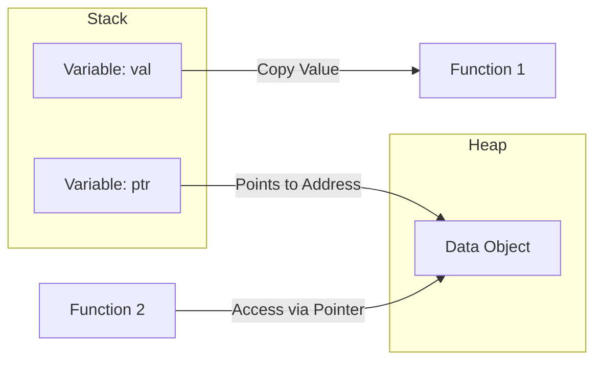

# CH-01: Value vs Pointer (Memory Semantics)

> **Source Link**: [The Go Programming Language Specification - Pointer types](https://golang.org/ref/spec#Pointer_types) | [Effective Go: Pointers vs. Values](https://golang.org/doc/effective_go#pointers_vs_values)

## 1. Konsep & Esensi (Definisi & Rasionalitas)

### Definisi ("Apa itu?")
- **Value Semantics**: Data disalin (copy) saat dikirim ke fungsi atau diberikan ke variabel lain.
- **Pointer Semantics**: Lokasi memori (address) yang dikirim, memungkinkan beberapa bagian program berbagi data yang sama.

### Rasionalitas ("Why & How?")
Pemilihan semantik berdampak langsung pada:
1. **Efficiency**: Struktur data besar lebih efisien dikirim sebagai pointer untuk menghindari penyalinan memori yang mahal.
2. **Mutation**: Hanya pointer yang memungkinkan fungsi pengirim mengubah nilai asli data tersebut.
3. **Escape Analysis**: Go secara otomatis menentukan apakah variabel cukup diletakkan di **Stack** (Cepat) atau harus "melarikan diri" ke **Heap** (Lambat tapi persisten) berdasarkan penggunaannya.

### Analogi Model Mental
- **Value**: Anda memfotokopi (copy) sebuah dokumen dan memberikannya ke teman. Jika teman mencoret-coret salinannya, dokumen asli Anda tetap bersih.
- **Pointer**: Anda memberikan alamat rumah/koordinat (address) ke teman. Jika teman masuk ke rumah tersebut dan mengubah warna temboknya, saat Anda pulang, tembok rumah Anda juga sudah berubah warna.

---

## 2. Visualisasi Sistem (Mermaid & SVG)

### Model Mental (SVG)

Model Mental (SVG)

### Alur Eksekusi (Mermaid)

---

## 3. Mekanisme Pembuktian (Algoritma Detil)
Go Compiler melakukan **Escape Analysis** selama kompilasi. Jika sebuah variabel direferensikan di luar scope fungsinya (misal: dikembalikan sebagai pointer), compiler akan memindahkannya ke Heap. Ini berbeda dengan C/C++ di mana programmer harus manual melakukan `new/malloc`.

---

## 4. Lab Praktis (Examples)
Silakan tinjau folder [examples/](./examples) untuk eksperimen berikut:
- `01_stack_copy.go`: Bukti bahwa modifikasi value tidak mengubah data asal.
- `02_pointer_share.go`: Berbagi data antar fungsi dengan pointer.
- `03_escape_demo.go`: Menggunakan `go build -gcflags="-m"` untuk melihat escape analysis.

---
*Unit ini memenuhi standar Platinum Gold (PPM V4).*
