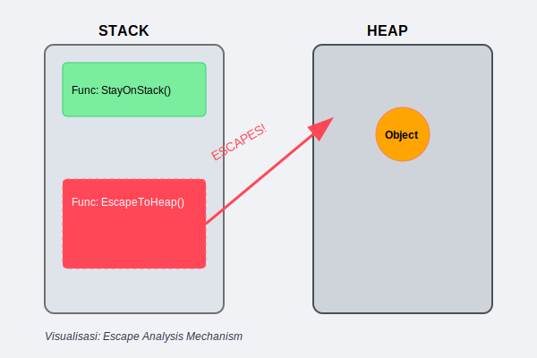
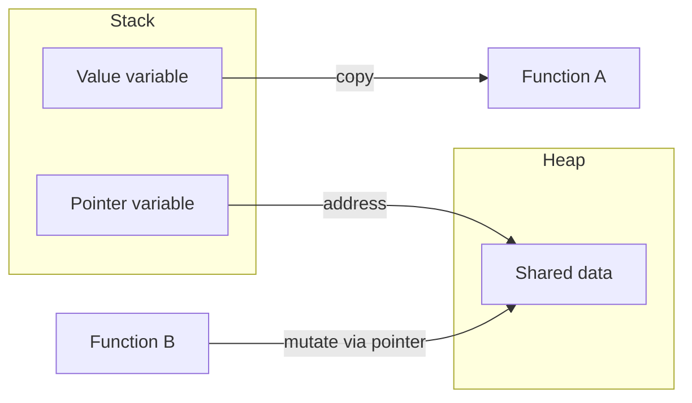

# CH-01: Value vs Pointer

## 1. Tahap 1: Source Alignment dan Judul

- **Source Link**: [Go Specification: Pointer types](https://go.dev/ref/spec#Pointer_types) | [Effective Go: Pointers vs Values](https://go.dev/doc/effective_go#pointers_vs_values)
- **Framing**: Salah satu keputusan desain paling penting di Go adalah kapan data sebaiknya dibawa sebagai nilai, dan kapan lebih masuk akal dibawa sebagai pointer.

## 2. Tahap 2: Konsep dan Rasionalitas

### Definisi
- **Value Semantics**: data disalin saat diberikan ke variabel lain atau dikirim ke fungsi.
- **Pointer Semantics**: yang dibagikan adalah alamat ke data yang sama, sehingga banyak bagian program bisa melihat objek yang sama.

### Rasionalitas
Pilihan antara value dan pointer berpengaruh langsung pada desain dan perilaku program:

1. **Biaya copy**  
   Nilai besar bisa mahal jika terus disalin.
2. **Mutasi data**  
   Pointer memungkinkan perubahan terlihat oleh pemanggil lain yang merujuk objek yang sama.
3. **Ownership yang lebih jelas atau lebih kabur**  
   Value cenderung lebih aman untuk isolasi, pointer lebih kuat untuk berbagi state.
4. **Implikasi pada escape analysis**  
   Bentuk penggunaan data bisa memengaruhi apakah compiler menaruhnya di stack atau memindahkannya ke heap.

### Analogi Model Mental
Value mirip seperti mengirim fotokopi dokumen: orang lain bisa mencoret-coret salinannya tanpa mengubah dokumen asli. Pointer mirip seperti memberi alamat gudang: siapa pun yang datang ke gudang yang sama akan melihat barang yang sama dan bisa mengubahnya di tempat.

### Terminologi Teknis
- **Value Semantics**: perpindahan data dengan copy.
- **Pointer Semantics**: perpindahan referensi ke lokasi data.
- **Shared Mutation**: perubahan bersama terhadap objek yang sama.
- **Escape Analysis**: analisis compiler untuk menentukan apakah data cukup hidup di stack atau perlu pindah ke heap.

## 3. Tahap 3: Visualisasi Sistem

## 4. Tahap 4: Mekanisme Pembuktian

Di level implementasi, compiler Go melakukan escape analysis untuk membantu menentukan tempat hidup data.

Poin desain yang penting di sini bukan sekadar "pointer lebih cepat" atau "value lebih aman", melainkan:
- value sering membuat alur data lebih jelas;
- pointer sering dibutuhkan saat berbagi atau mengubah objek yang sama;
- keputusan ini berdampak pada biaya copy, keterbacaan, dan perilaku memori.

## 5. Tahap 5: Lab Praktis

Lihat pembuktian kode di folder [examples/](./examples):
- [01_stack_copy.go](./examples/01_stack_copy.go) - Menunjukkan bahwa perubahan pada value copy tidak mengubah asalnya.
- [02_pointer_share.go](./examples/02_pointer_share.go) - Menunjukkan bagaimana pointer membuat data yang sama dibagi antar fungsi.
- [03_escape_demo.go](./examples/03_escape_demo.go) - Melihat efek escape analysis dengan flag compiler.

---
*Status: [x] Complete*
