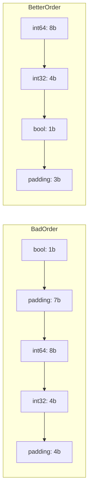

# CH-02: Memory Layout and Padding

## 1. Tahap 1: Source Alignment dan Judul

- **Source Link**: [Go Specification: Size and alignment guarantees](https://go.dev/ref/spec#Size_and_alignment_guarantees) | [Go Blog: Writing memory-efficient Go](https://go.dev/blog/writing-memory-efficient-go)
- **Framing**: Urutan field dalam struct bukan cuma soal gaya, tetapi bisa memengaruhi ukuran objek dan efisiensi akses memori.

## 2. Tahap 2: Konsep dan Rasionalitas

### Definisi
Setiap tipe di Go punya ukuran dan kebutuhan alignment. Agar field bisa diakses dengan efisien, compiler bisa menambahkan ruang kosong di antara field struct. Ruang kosong itulah yang disebut padding.

### Rasionalitas
Memory layout penting karena:

1. **Ukuran struct bisa membesar tanpa terasa**  
   Urutan field yang kurang tepat bisa menghasilkan banyak padding.
2. **Akses memori lebih rapi untuk CPU**  
   Alignment membantu CPU membaca data dengan lebih efisien.
3. **Desain data jadi punya biaya nyata**  
   Susunan field bukan cuma masalah estetik, tetapi juga soal footprint memori.

### Analogi Model Mental
Bayangkan rak buku dengan sekat-sekat tetap. Kalau buku tipis dan tebal disusun sembarangan, akan muncul banyak ruang kosong yang terbuang. Kalau disusun lebih rapi, rak terisi lebih efisien. Padding di struct mirip ruang kosong itu.

### Terminologi Teknis
- **Alignment**: aturan penyelarasan alamat memori untuk tipe tertentu.
- **Padding**: ruang kosong tambahan agar alignment tetap terpenuhi.
- **Struct Layout**: susunan field dalam representasi memori.
- **Memory Footprint**: total ukuran memori yang dipakai objek.

## 3. Tahap 3: Visualisasi Sistem

## 4. Tahap 4: Mekanisme Pembuktian

Go menentukan layout field berdasarkan aturan alignment arsitektur target. Secara praktis, field tertentu perlu ditempatkan pada alamat yang sesuai dengan kebutuhan alignment-nya, dan compiler menambah padding bila perlu.

Pelajaran desain yang penting:
- urutan field dapat memengaruhi ukuran total struct;
- struktur data yang lebih hemat bisa mengurangi footprint memori;
- optimisasi layout sebaiknya dipakai saat memang relevan, bukan sebagai obsesi di semua tempat.

## 5. Tahap 5: Lab Praktis

Lihat pembuktian kode di folder [examples/](./examples):
- [01_struct_size.go](./examples/01_struct_size.go) - Menggunakan `unsafe.Sizeof` dan `unsafe.Offsetof` untuk membedah layout struct.

---
*Status: [x] Complete*
