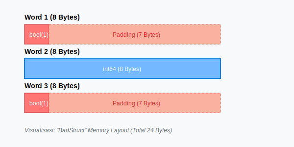

# CH-02: Memory Layout & Padding (The CPU Efficiency)

> **Source Link**: [Go Blog: The Go Blog: Writing memory-efficient Go](https://blog.golang.org/writing-memory-efficient-go) | [Go Specification: Size and alignment guarantees](https://golang.org/ref/spec#Size_and_alignment_guarantees)

## 1. Konsep & Esensi (Definisi & Rasionalitas)

### Definisi ("Apa itu?")
Setiap tipe data di Go memiliki ukuran (size) dan persyaratan penyelarasan (**Alignment**). Memori dialokasikan dalam kelipatan kata (word size), biasanya 8 byte pada sistem 64-bit.

### Rasionalitas ("Why & How?")
CPU membaca memori dalam blok (cache lines). Jika data tidak selaras (misaligned), CPU mungkin harus melakukan dua kali pembacaan untuk satu variabel. Go menambahkan **Padding** (ruang kosong) di antara field struct untuk memastikan setiap field dimulai pada alamat yang selaras.
Strategi pengurutan field dari besar ke kecil (**Descending Order**) dapat meminimalkan padding dan menghemat memori.

### Analogi Model Mental
Bayangkan memori sebagai sebuah **Rak Buku** dengan sekat setiap 8 cm. Jika Anda memiliki buku tebal 4 cm dan buku tipis 1 cm, lalu buku tebal lagi 4 cm:
- Jika tidak diatur, buku tebal kedua mungkin harus terpotong sekat (**Padding** diperlukan).
- Jika Anda menaruh buku 4 cm, 4 cm, lalu 1 cm secara berurutan, Anda mengisi ruang secara optimal tanpa banyak celah kosong.

---

## 2. Visualisasi Sistem (Mermaid & SVG)

### Layout Memori (SVG)


### Perbandingan Struktur (Mermaid)
```mermaid
graph LR

    subgraph BadOrder
        A[bool: 1b] --> P1[Padding: 7b]
        P1 --> B[int64: 8b]
        B --> C[int32: 4b]
        C --> P2[Padding: 4b]
    end
    subgraph OptimizedOrder
        D[int64: 8b] --> E[int32: 4b]
        E --> F[bool: 1b]
        F --> P3[Padding: 3b]
    end
    Note over BadOrder: Total: 24 bytes
    Note over OptimizedOrder: Total: 16 bytes
```

---

## 3. Mekanisme Pembuktian (Algoritma Detil)
Go menentukan aligment berdasarkan arsitektur CPU. Aturan dasarnya: sebuah field dengan ukuran `n` byte harus diletakkan pada alamat yang merupakan kelipatan dari `n` (hingga batas maksimum word size, misal 8).

---

## 4. Lab Praktis (Examples)
Silakan tinjau folder [examples/](./examples) untuk eksperimen berikut:
- `01_struct_size.go`: Menggunakan `unsafe.Sizeof` dan `unsafe.Offsetof` untuk membedah layout.
- `02_alignment_audit.go`: Perbandingan penggunaan memori antara struct yang dioptimasi vs tidak.

---
*Unit ini memenuhi standar Platinum Gold (PPM V4).*
