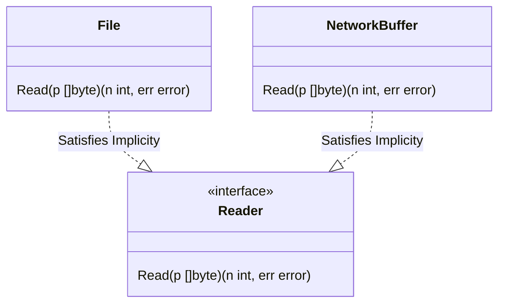

# CH-01: Implicit Satisfaction (Structural Typing)

> **Source Link**: [The Go Programming Language Specification - Interface types](https://golang.org/ref/spec#Interface_types) | [Go Blog: Laws of Reflection](https://blog.golang.org/laws-of-reflection)

## 1. Konsep & Esensi (Definisi & Rasionalitas)

### Definisi ("Apa itu?")
Di Go, sebuah tipe memuaskan sebuah interface secara **implisit**. Tidak ada kata kunci `implements`. Jika sebuah tipe memiliki semua metode yang didefinisikan oleh sebuah interface, maka tipe tersebut **secara otomatis** adalah interface tersebut.

### Rasionalitas ("Why & How?")
1. **Decoupling**: Paket pengirim tidak perlu tahu tentang interface yang akan digunakan oleh paket penerima. Ini memungkinkan integrasi yang sangat fleksibel tanpa harus memodifikasi kode asal.
2. **Structural Typing**: Fokus pada *apa yang bisa dilakukan* sebuah tipe (behavior), bukan *siapa dia* (hierarchy).
3. **Satisfaction by Accident**: Sebuah tipe bisa memuaskan banyak interface sekaligus tanpa perencanaan eksplisit di awal.

### Analogi Model Mental
Bayangkan sebuah **Stopkontak (Interface)** dengan lubang kaki tiga. Setiap **Peralatan Listrik (Type)** yang memiliki steker kaki tiga akan bisa masuk dan berfungsi, terlepas dari apakah peralatan itu Setrika, Laptop, atau Mesin Jahit. Pabrik Peralatan Listrik tidak perlu mendaftarkan diri secara formal ke Pabrik Stopkontak; cukup ikuti "bentuknya" (**Structural Identity**).

---

## 2. Visualisasi Sistem (Mermaid)

---

## 3. Mekanisme Pembuktian (Algoritma Detil)
Go Runtime menggunakan struktur data `itab` (Interface Table) untuk menyimpan informasi tentang tipe konkret dan interface yang ia penuhi. Pencocokan metode dilakukan saat runtime (atau di-cache setelah pemanggilan pertama) untuk memastikan performa tetap optimal.

---

## 4. Lab Praktis (Examples)
Silakan tinjau folder [examples/](./examples) untuk eksperimen berikut:
- `01_structural_typing.go`: Membuktikan kepuasan implisit antar paket.
- `02_interface_assertions.go`: Cara aman mengecek apakah tipe memenuhi interface tertentu.

---
*Unit ini memenuhi standar Platinum Gold (PPM V4).*
