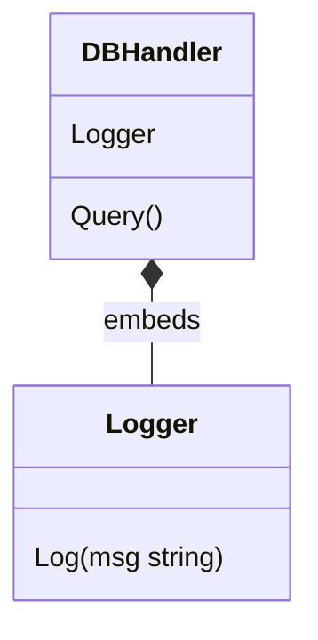

# CH-02: Composition vs Inheritance

## 1. Tahap 1: Source Alignment dan Judul

- **Source Link**: [Effective Go: Embedding](https://go.dev/doc/effective_go#embedding)
- **Framing**: Go tidak memberi inheritance klasik, tetapi memberi alat komposisi yang sengaja dirancang agar sistem lebih datar dan lebih fleksibel.

## 2. Tahap 2: Konsep dan Rasionalitas

### Definisi
Go tidak memakai inheritance tradisional berbasis class hierarchy. Sebagai gantinya, Go mendorong composition melalui struct embedding dan penggabungan komponen kecil yang punya tanggung jawab jelas.

### Rasionalitas
Pendekatan ini penting karena:

1. **Mengurangi hierarki yang rapuh**  
   Perubahan pada satu komponen tidak otomatis menciptakan efek berantai seperti base class yang terlalu besar.
2. **Mendorong desain yang lebih modular**  
   Komponen bisa dirakit ulang sesuai kebutuhan.
3. **Lebih cocok dengan gaya Go**  
   Go lebih nyaman dengan objek yang sederhana, tanggung jawab yang jelas, dan behavior yang dikomposisikan.

### Analogi Model Mental
Membangun mobil lebih masuk akal sebagai perakitan mesin, roda, rangka, dan kemudi daripada memaksa semua kendaraan hidup di pohon warisan kelas yang sangat dalam. Komposisi di Go bekerja seperti proses perakitan itu.

### Terminologi Teknis
- **Composition**: membangun objek dari komponen yang digabungkan.
- **Embedding**: menyisipkan tipe lain ke dalam struct untuk membawa field atau method.
- **Method Promotion**: method dari tipe yang di-embed bisa diakses dari struct luar.

## 3. Tahap 3: Visualisasi Sistem

## 4. Tahap 4: Mekanisme Pembuktian

Saat method dipanggil pada struct luar, compiler akan mencari method itu lebih dulu di tipe luar. Jika tidak ada, pencarian bisa diteruskan ke tipe yang di-embed. Inilah yang membuat embedding terasa seperti "membawa" perilaku tanpa benar-benar menciptakan inheritance tradisional.

Pelajaran desain pentingnya:
- komposisi memberi fleksibilitas;
- embedding membantu ergonomi;
- tetapi relasi antar komponen tetap lebih eksplisit daripada pewarisan class.

## 5. Tahap 5: Lab Praktis

Lihat pembuktian kode di folder [examples/](./examples):
- [01_embedding_basics.go](./examples/01_embedding_basics.go) - Dasar penggunaan struct embedding.

---
*Status: [x] Complete*
