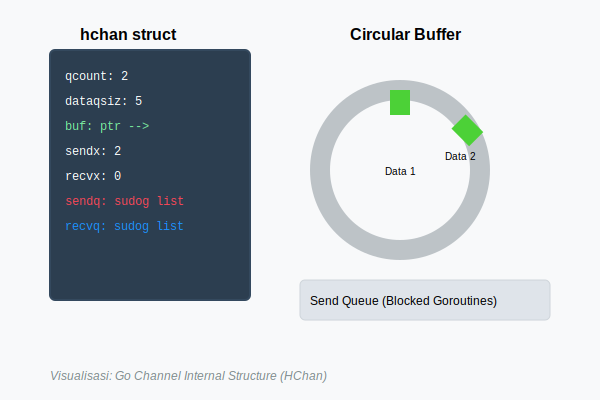
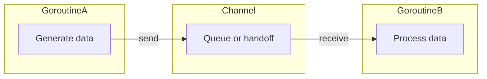

# CH-01: Share by Communicating

## 1. Tahap 1: Source Alignment dan Judul

- **Source Link**: [Effective Go: Share by communicating](https://go.dev/doc/effective_go#sharing)
- **Framing**: Salah satu ide paling khas di Go adalah ini: data lebih aman dibagikan lewat komunikasi yang jelas daripada diperebutkan langsung lewat state bersama.

## 2. Tahap 2: Konsep dan Rasionalitas

### Definisi
Prinsip "share memory by communicating" berarti goroutine lebih disarankan bertukar data lewat channel daripada banyak goroutine mengakses state yang sama secara langsung.

### Rasionalitas
Pendekatan ini dipilih karena:

1. **Alur data jadi lebih terlihat**  
   Kita bisa melihat siapa mengirim, siapa menerima, dan kapan perpindahan kerja terjadi.
2. **Ownership lebih mudah dipahami**  
   Saat data dikirim ke channel, model mentalnya adalah tanggung jawab berpindah ke penerima.
3. **Sinkronisasi jadi lebih terstruktur**  
   Channel membantu menyatukan komunikasi dan koordinasi dalam satu mekanisme.

### Analogi Model Mental
Bayangkan dapur restoran. Kalau semua koki berebut talenan yang sama, mereka perlu terus mengunci dan membuka akses. Tapi kalau bahan dipindahkan lewat ban berjalan dari satu koki ke koki berikutnya, alur kerja jadi lebih rapi dan konflik berkurang.

### Terminologi Teknis
- **Channel**: jalur komunikasi antar goroutine.
- **Ownership Transfer**: perpindahan tanggung jawab pemrosesan data.
- **Coordinated Concurrency**: concurrency yang dibangun dengan alur komunikasi yang jelas.

## 3. Tahap 3: Visualisasi Sistem

## 4. Tahap 4: Mekanisme Pembuktian

Di level desain, channel menggabungkan dua hal sekaligus: perpindahan data dan sinkronisasi. Itulah kenapa channel terasa sangat kuat untuk membangun alur kerja concurrent.

Yang penting untuk `RAK-04` adalah memahami kenapa model ini dipilih:
- bukan karena channel selalu menggantikan semua alat lain;
- tetapi karena Go sengaja memberi prioritas pada model komunikasi yang lebih mudah dibaca untuk banyak masalah concurrency.

## 5. Tahap 5: Lab Praktis

Lihat pembuktian kode di folder [examples/](./examples):
- [01_simple_channel.go](./examples/01_simple_channel.go) - Dasar pengiriman dan penerimaan data lewat channel.

---
*Status: [x] Complete*
