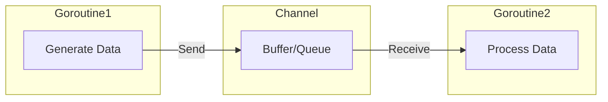

# CH-01: Share by Communicating (The CSP Model)

> **Source Link**: [Effective Go: Share by communicating](https://golang.org/doc/effective_go#sharing) | [Communicating Sequential Processes (Hoare, 1978)](https://www.cs.cmu.edu/~crary/819-f09/Hoare78.pdf)

## 1. Konsep & Esensi (Definisi & Rasionalitas)

### Definisi ("Apa itu?")
Slogan filosofis terpenting Go adalah: *"Do not communicate by sharing memory; instead, share memory by communicating."* Ini merujuk pada penggunaan **Channels** untuk mengirim data antar goroutine, bukannya menggunakan variabel global atau state yang dilindungi oleh lock (Mutex).

### Rasionalitas ("Why & How?")
1. **Concurrency Safety**: Mengirim data via channel memberikan "kepemilikan" (ownership) data tersebut ke goroutine penerima, sehingga mencegah *Race Conditions*.
2. **Simplified Logic**: Aliran data menjadi linear dan mudah dipahami, seperti ban berjalan (assembly line).
3. **Internal Sync**: Channel secara internal sudah memiliki mekanisme sinkronisasi, sehingga programmer tidak perlu pusing dengan manajemen lock manual yang rawan bug.

### Analogi Model Mental
Bayangkan sebuah **Dapur Restoran**.
- **Share Memory**: Banyak koki berebut satu talenan yang sama. Mereka harus teriak "SAYA PAKAI!" (Lock) agar tidak saling potong tangan. Kelupaan teriak bisa berakibat fatal (**Panic/Crash**).
- **Share by Communicating**: Setiap koki punya talenan sendiri. Jika bahan makanan siap, mereka menaruhnya di **Ban Berjalan (Channel)** ke koki berikutnya. Koki berikutnya hanya akan bekerja jika ada barang di ban berjalan tersebut. Tidak ada perebutan, alur kerja lancar.

---

## 2. Visualisasi Sistem (Mermaid & SVG)

### Model Mental (SVG)

### Alur Komunikasi (Mermaid)

---

## 3. Mekanisme Pembuktian (Algoritma Detil)
Go Channel didasarkan pada model matematis **CSP (Communicating Sequential Processes)** oleh Tony Hoare. Saat data dikirim melalui channel, runtime menangani pemindahan pointer atau penyalinan data secara aman di bawah kap mesin, termasuk memblokir goroutine yang mengirim jika buffer penuh atau menerima jika buffer kosong.

---

## 4. Lab Praktis (Examples)
Silakan tinjau folder [examples/](./examples) untuk eksperimen berikut:
- `01_simple_channel.go`: Dasar pengiriman dan penerimaan data.
- `02_ownership_transfer.go`: Demonstrasi perpindahan tanggung jawab pemrosesan data.

---
*Unit ini memenuhi standar Platinum Gold (PPM V4).*
