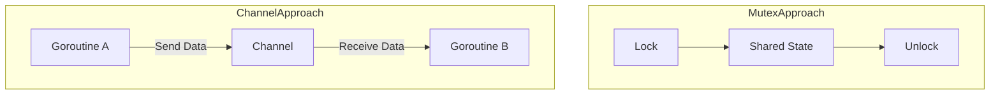

# CH-02: Don't Communicate by Sharing (Mutex vs Channels)

> **Source Link**: [Go Wiki: Mutex or Channel?](https://github.com/golang/go/wiki/CodeReviewComments#mutexes)

## 1. Konsep & Esensi (Definisi & Rasionalitas)

### Definisi ("Apa itu?")
Meskipun Go mempromosikan Channels (`share by communicating`), bukan berarti Mutex (Mutual Exclusion) tidak berguna. Prinsip ini mengajarkan kita kapan harus menggunakan **Sync Primitives (Mutex)** vs **Orchestration (Channels)**.

### Rasionalitas ("Why & How?")
- **Gunakan Mutex untuk**: Melindungi state internal sebuah objek kecil (misal: counter, cache map sederhana) di mana performa adalah kunci utama dan tidak ada logika aliran data yang kompleks.
- **Gunakan Channels untuk**: Mengomunikasikan hasil pemrosesan, mendistribusikan beban kerja, atau melakukan sinkronisasi antar unit logika yang berbeda.

### Analogi Model Mental
- **Mutex**: Seperti **Kunci Kamar Mandi**. Hanya satu orang yang bisa masuk. Jika sudah selesai, pintu dibuka untuk orang lain. Ini tentang **Kepemilikan Sumber Daya**.
- **Channels**: Seperti **E-mail**. Kita mengirim pesan berisi informasi ke orang lain. Ini tentang **Transfer Informasi**.

---

## 2. Visualisasi Sistem (Mermaid)

---

## 3. Mekanisme Pembuktian (Algoritma Detil)
`sync.Mutex` di Go diimplementasikan dengan sangat efisien menggunakan operasi **Atomic (Compare-and-Swap)**. Jika lock tidak bisa didapatkan segera, goroutine akan masuk ke dalam antrean tunggu tanpa memakan banyak siklus CPU (melalui mekanisme *Spinning* singkat sebelum *Park*).

---

## 4. Lab Praktis (Examples)
Silakan tinjau folder [examples/](./examples) untuk eksperimen berikut:
- `01_mutex_counter.go`: Contoh penggunaan Mutex yang benar untuk state bersama.
- `02_channel_sync.go`: Perbandingan di mana Channel lebih elegan daripada Mutex.

---
*Unit ini memenuhi standar Platinum Gold (PPM V4).*
