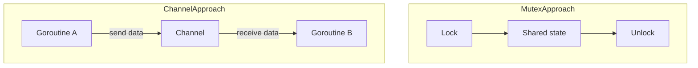

# CH-02: Don't Communicate by Sharing

## 1. Tahap 1: Source Alignment dan Judul

- **Source Link**: [Go Wiki: Mutex or Channel?](https://go.dev/wiki/MutexOrChannel)
- **Framing**: Filosofi Go bukan berarti mutex itu buruk. Yang penting adalah memilih alat yang sesuai dengan bentuk masalahnya.

## 2. Tahap 2: Konsep dan Rasionalitas

### Definisi
Prinsip ini menekankan bahwa banyak masalah concurrent lebih mudah dipahami jika komunikasi dibangun lewat channel, bukan dengan banyak goroutine yang berbagi dan mengunci state yang sama. Namun dalam beberapa kasus, mutex tetap menjadi alat yang tepat.

### Rasionalitas
Cara memilih alatnya bisa dilihat seperti ini:

1. **Mutex cocok untuk melindungi state kecil yang dibagi bersama**  
   Misalnya counter, cache sederhana, atau objek dengan invariants internal yang jelas.
2. **Channel cocok untuk mengalirkan kerja atau data**  
   Misalnya distribusi tugas, pipeline, atau koordinasi antar unit logika.
3. **Desain lebih penting daripada slogan literal**  
   Filosofi Go membantu memilih model yang membuat sistem lebih mudah dipahami, bukan memaksa satu alat dipakai di semua tempat.

### Analogi Model Mental
Mutex mirip kunci kamar mandi: satu orang masuk, selesai, lalu keluar. Channel mirip mengirim email atau paket kerja ke orang lain: fokusnya bukan mengunci ruangan, tetapi memindahkan informasi dan tanggung jawab.

### Terminologi Teknis
- **Mutex**: primitive sinkronisasi untuk melindungi akses ke state bersama.
- **Channel**: jalur komunikasi dan koordinasi antar goroutine.
- **Shared State**: data yang bisa disentuh lebih dari satu goroutine.
- **Ownership**: pihak yang saat ini bertanggung jawab atas data atau pekerjaan.

## 3. Tahap 3: Visualisasi Sistem

## 4. Tahap 4: Mekanisme Pembuktian

Di level implementasi, mutex dan channel sama-sama alat concurrency yang sah, tetapi mereka menyelesaikan bentuk masalah yang berbeda.

Pelajaran desain penting di chapter ini:
- gunakan mutex saat fokusnya perlindungan state;
- gunakan channel saat fokusnya aliran kerja atau komunikasi;
- jangan memperlakukan slogan Go sebagai larangan mutlak, tetapi sebagai panduan memilih model yang paling jelas.

## 5. Tahap 5: Lab Praktis

Lihat pembuktian kode di folder [examples/](./examples):
- [01_mutex_counter.go](./examples/01_mutex_counter.go) - Contoh mutex untuk melindungi state bersama yang sederhana.

---
*Status: [x] Complete*
