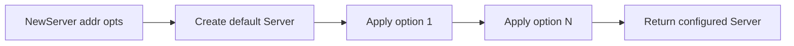

# CH-01: Functional Options

## 1. Tahap 1: Source Alignment dan Judul

- **Source Link**: [Dave Cheney: Functional options for friendly APIs](https://dave.cheney.net/2014/10/17/functional-options-for-friendly-apis) | [Go Blog: First-Class Functions in Go](https://go.dev/blog/first-class-functions-in-go)
- **Framing**: Pola ini dipakai saat sebuah constructor mulai butuh banyak konfigurasi opsional, tetapi kita tetap ingin API-nya terasa ringan saat dipakai.

## 2. Tahap 2: Konsep dan Rasionalitas

### Definisi
Functional options adalah pola di mana konfigurasi tambahan dikirim sebagai daftar fungsi yang memodifikasi objek target saat proses konstruksi berlangsung.

### Rasionalitas
Pola ini dipilih karena:

1. **Default tetap sederhana**  
   Pemanggil cukup memakai `NewServer("localhost")` untuk kasus biasa tanpa harus mengisi banyak argumen kosong.
2. **Ekstensi lebih aman**  
   Opsi baru bisa ditambahkan tanpa memaksa perubahan signature constructor yang sudah dipakai di banyak tempat.
3. **Konfigurasi lebih terbaca**  
   Pemanggilan seperti `WithPort(9000)` biasanya lebih mudah dipahami daripada deretan argumen positional yang panjang.

### Analogi Model Mental
Bayangkan memesan kopi. Dasarnya satu: kopi hitam. Setelah itu, tambahan seperti gula, susu, atau ukuran besar diberikan sebagai instruksi tambahan. Kalau tidak ada instruksi tambahan, minuman dasarnya tetap valid.

### Terminologi Teknis
- **Option**: fungsi yang mengubah state target saat inisialisasi.
- **Variadic Parameters**: daftar argumen opsional yang dikirim dalam bentuk `opts ...Option`.
- **Constructor Boundary**: titik pusat tempat default dan konfigurasi tambahan dipadukan.

## 3. Tahap 3: Visualisasi Sistem

## 4. Tahap 4: Mekanisme Pembuktian

Di balik pola ini, Go memanfaatkan fungsi sebagai nilai. Setiap option biasanya berupa closure yang menangkap parameter tertentu, lalu menerapkannya ke struct target.

Urutan mentalnya sederhana:
- constructor membuat objek dengan nilai default;
- semua option dijalankan satu per satu;
- hasil akhirnya dikembalikan sebagai objek yang sudah terkonfigurasi.

Yang penting untuk `RAK-04` bukan sekadar syntax-nya, tetapi alasan desainnya: Go sering memilih komposisi fungsi kecil yang mudah dirangkai daripada constructor yang makin lama makin gemuk.

## 5. Tahap 5: Lab Praktis

Lihat pembuktian kode di folder [examples/](./examples):
- [01_basic_options.go](./examples/01_basic_options.go) - Dasar functional options untuk memberi konfigurasi tambahan di atas nilai default.

---
*Status: [x] Complete*
