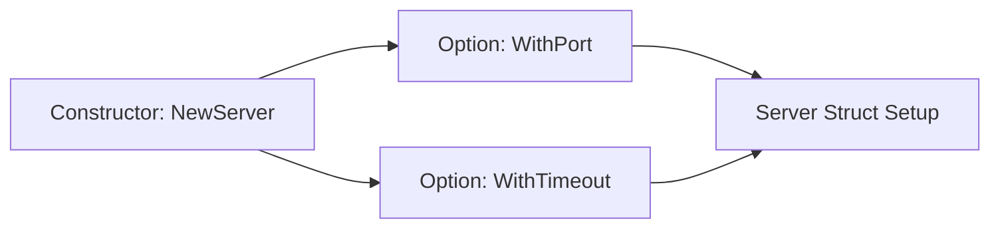

# CH-01: Functional Options (Robust API Design)

> **Source Link**: [Dave Cheney: Functional options for friendly APIs](https://dave.cheney.net/2014/10/17/functional-options-for-friendly-apis) | [Self-referential functions and the design of options](https://blog.commandlineinterface.at/2021/01/29/functional-options/)

## 1. Konsep & Esensi (Definisi & Rasionalitas)

### Definisi ("Apa itu?")
Functional Options adalah pola desain untuk membuat API yang fleksibel dan mudah dipahami, terutama untuk konstruktor (`New`) yang membutuhkan banyak argumen opsional. Setiap opsi direpresentasikan sebagai fungsi yang memodifikasi state objek.

### Rasionalitas ("Why & How?")
1. **Extensibility**: Menambah opsi baru di masa depan tidak akan mematikan kode yang sudah ada (tidak memecah API contract).
2. **Readability**: Menghindari "Constructor Overloading" atau struct konfigurasi yang penuh dengan pointer/default values yang membingungkan.
3. **Safety**: Memungkinkan pembuat API untuk memvalidasi konfigurasi secara atomik sebelum objek dibuat sepenuhnya.

### Analogi Model Mental
Bayangkan memesan **Kopi Custom**.
- **Tanpa Options**: Anda harus menyebutkan 10 variabel (Gula, Susu, Es, Ukuran, dst) saat memesan. Jika lupa satu, pesanan gagal.
- **Functional Options**: Anda memesan "Kopi Hitam" (`NewCoffee`), lalu memberikan instruksi tambahan seperti `WithSugar(2)` atau `WithMilk()`. Jika Anda tidak memberikan instruksi, Anda tetap mendapatkan Kopi Hitam standar.

---

## 2. Visualisasi Sistem (Mermaid)

---

## 3. Mekanisme Pembuktian (Algoritma Detil)
Pola ini menggunakan closure. Fungsi opsi biasanya memiliki signature `func(*Server) error`. Dalam loop internal constructor, fungsi-fungsi ini dipanggil secara berurutan untuk mengisi field-field struct target.

---

## 4. Lab Praktis (Examples)
Silakan tinjau folder [examples/](./examples) untuk eksperimen berikut:
- `01_basic_options.go`: Implementasi sederhana pola functional options.
- `02_validation_options.go`: Menambahkan logika validasi di dalam fungsi opsi.

---
*Unit ini memenuhi standar Platinum Gold (PPM V4).*
