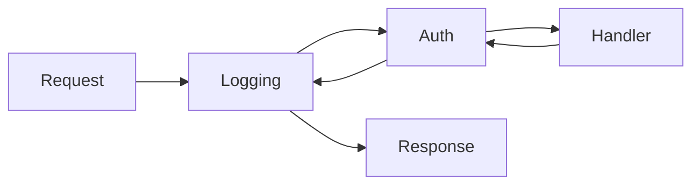

# CH-02: Middleware Chaining (The Interceptor Pattern)

> **Source Link**: [Go Blog: HTTP Pipeline](https://blog.golang.org/http-tracing) | [JustForFunc: Middleware in Go](https://www.youtube.com/watch?v=0w7S_iJid0I)

## 1. Konsep & Esensi (Definisi & Rasionalitas)

### Definisi ("Apa itu?")
Middleware adalah fungsi yang membungkus fungsi lain (handler) untuk menangani logika lintas sektoral (cross-cutting concerns) seperti Logging, Autentikasi, atau Pemulihan dari Panic.

### Rasionalitas ("Why & How?")
1. **DRY (Don't Repeat Yourself)**: Menghindari penulisan kode autentikasi yang sama di setiap endpoint.
2. **Separation of Concerns**: Memisahkan logika bisnis inti dari infrastruktur (misal: monitoring).
3. **Layered Architecture**: Memungkinkan penambahan lapisan keamanan secara dinamis tanpa menyentuh core logic.

### Analogi Model Mental
Bayangkan sebuah **Bandara (Airport)**.
- **Handler**: Terminal Pesawat (Tujuan Utama).
- **Middleware**: Pos Pemeriksaan Tiket, Scan X-Ray, dan Imigrasi. Anda tidak bisa sampai ke Terminal tanpa melewati lapisan-lapisan ini. Setiap lapisan bisa menolak Anda (**Early Return**) jika syarat tidak terpenuhi.

---

## 2. Visualisasi Sistem (Mermaid)

---

## 3. Mekanisme Pembuktian (Algoritma Detil)
Mekanisme ini memanfaatkan fungsi tingkat tinggi (*Higher-order functions*) dan closure. Handler di Go adalah interface `http.Handler` dengan satu metode `ServeHTTP`. Middleware mengambil `http.Handler` dan mengembalikan `http.Handler` baru yang mengeksekusi logika tambahan sebelum/sesudah memanggil handler asli.

---

## 4. Lab Praktis (Examples)
Silakan tinjau folder [examples/](./examples) untuk eksperimen berikut:
- `01_basic_middleware.go`: Membuat logger middleware sederhana.
- `02_middleware_chain.go`: Menggabungkan beberapa middleware menjadi satu kesatuan.

---
*Unit ini memenuhi standar Platinum Gold (PPM V4).*
