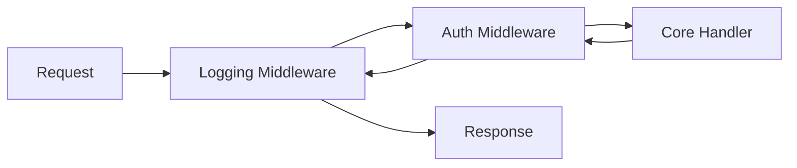

# CH-02: Middleware Chaining

## 1. Tahap 1: Source Alignment dan Judul

- **Source Link**: [net/http: Handler](https://pkg.go.dev/net/http#Handler) | [net/http: HandlerFunc](https://pkg.go.dev/net/http#HandlerFunc)
- **Framing**: Middleware chaining menunjukkan kenapa Go nyaman membangun perilaku lintas fungsi sebagai lapisan kecil yang bisa dibungkus satu per satu.

## 2. Tahap 2: Konsep dan Rasionalitas

### Definisi
Middleware adalah fungsi yang menerima handler lain, lalu mengembalikan handler baru dengan perilaku tambahan di sekeliling handler asli.

### Rasionalitas
Pola ini dipilih karena:

1. **Cross-cutting concern tidak bocor ke business logic**  
   Logging, authentication, metrics, atau recovery bisa ditempatkan di lapisan terpisah.
2. **Penyusunan perilaku jadi modular**  
   Kita bisa menambah atau melepas satu lapisan tanpa menulis ulang handler inti.
3. **Alur request lebih mudah dibaca**  
   Rangkaian middleware memperlihatkan urutan pemeriksaan sebelum request mencapai logic utama.

### Analogi Model Mental
Bayangkan penumpang masuk ke area keberangkatan bandara. Sebelum sampai ke gate, ia melewati pemeriksaan tiket, scan keamanan, dan verifikasi identitas. Gate tetap sama, tetapi akses ke sana dibentuk oleh lapisan-lapisan yang membungkus jalur masuknya.

### Terminologi Teknis
- **Handler**: komponen yang memproses request utama.
- **Wrapper**: fungsi pembungkus yang menambahkan perilaku sebelum atau sesudah handler asli.
- **Cross-cutting Concern**: logika umum yang dipakai di banyak endpoint.

## 3. Tahap 3: Visualisasi Sistem

## 4. Tahap 4: Mekanisme Pembuktian

Di Go, pola ini terasa natural karena function dan interface sama-sama ringan untuk dikomposisikan. Pada `net/http`, middleware biasanya menerima `http.Handler`, lalu mengembalikan `http.Handler` baru yang menjalankan logika tambahan sebelum atau sesudah `next.ServeHTTP(...)`.

Inti desain yang perlu ditangkap:
- handler inti tetap kecil dan fokus;
- lapisan tambahan dirangkai dari luar;
- urutan pembungkusan menentukan urutan eksekusi request dan response.

Itulah kenapa pola ini penting di `RAK-04`: ia menunjukkan cara Go membangun arsitektur dari komposisi fungsi kecil, bukan dari inheritance yang berat.

## 5. Tahap 5: Lab Praktis

Lihat pembuktian kode di folder [examples/](./examples):
- [01_basic_middleware.go](./examples/01_basic_middleware.go) - Middleware logger sederhana yang membungkus handler HTTP dasar.

---
*Status: [x] Complete*
