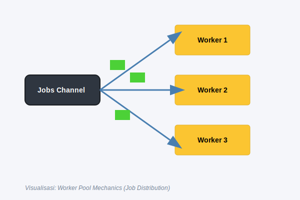
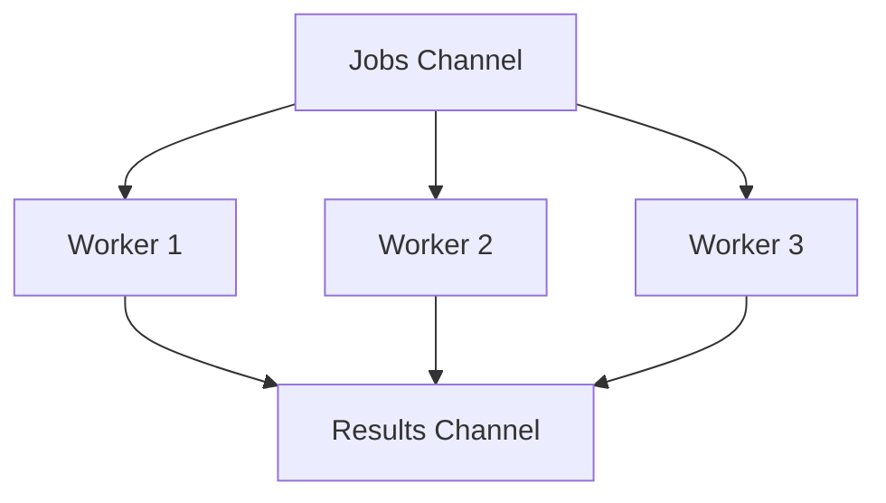

# CH-01: Worker Pools

## 1. Tahap 1: Source Alignment dan Judul

- **Source Link**: [Effective Go: Share by communicating](https://go.dev/doc/effective_go#sharing) | [Go by Example: Worker Pools](https://gobyexample.com/worker-pools)
- **Framing**: Worker pool dipakai saat kita ingin concurrency tetap berjalan cepat, tetapi jumlah pekerjaan yang aktif perlu dibatasi supaya sistem tidak liar.

## 2. Tahap 2: Konsep dan Rasionalitas

### Definisi
Worker pool adalah pola di mana sejumlah worker goroutine mengambil job dari satu sumber kerja bersama, lalu memprosesnya secara paralel dalam batas kapasitas tertentu.

### Rasionalitas
Pola ini dipilih karena:

1. **Concurrency bisa dibatasi**  
   Sistem tidak perlu membuat goroutine tanpa batas hanya karena jumlah job bertambah.
2. **Beban lebih stabil**  
   CPU, memori, database, atau service lain tidak langsung dibanjiri permintaan serentak.
3. **Operasi batch lebih mudah diatur**  
   Distribusi kerja dan pengumpulan hasil bisa dipahami sebagai satu arsitektur yang jelas.

### Analogi Model Mental
Bayangkan loket bank dengan tiga teller. Nasabah boleh banyak, tetapi yang aktif dilayani tetap dibatasi tiga orang pada satu waktu. Antrean tetap bergerak, tapi kapasitas layanan tidak meledak liar.

### Terminologi Teknis
- **Worker**: goroutine yang mengambil dan memproses job.
- **Job Queue**: channel atau antrean tempat pekerjaan dikirim.
- **Bounded Concurrency**: jumlah pekerjaan aktif dibatasi dengan sengaja.

## 3. Tahap 3: Visualisasi Sistem

## 4. Tahap 4: Mekanisme Pembuktian

Di Go, pola ini biasanya dibangun dengan channel sebagai jalur distribusi kerja. Banyak goroutine membaca dari job queue yang sama, lalu runtime menjadwalkan siapa yang lebih dulu menerima kerja berikutnya.

Yang penting di `RAK-04` bukan sekadar "cara bikin worker", tetapi alasan arsitekturnya:
- kita membatasi concurrency secara sadar;
- kita memisahkan produsen job dari pemroses job;
- kita membuat sistem lebih mudah dikendalikan saat beban naik.

## 5. Tahap 5: Lab Praktis

Lihat pembuktian kode di folder [examples/](./examples):
- [01_fixed_pool.go](./examples/01_fixed_pool.go) - Worker pool sederhana dengan jumlah worker tetap dan channel hasil.

---
*Status: [x] Complete*
