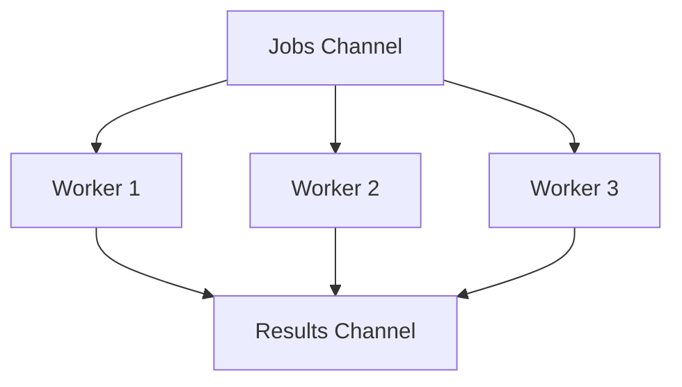

# CH-01: Worker Pools (Resource Management)

> **Source Link**: [Go by Example: Worker Pools](https://gobyexample.com/worker-pools) | [Effective Go: Parallelization](https://golang.org/doc/effective_go#parallel)

## 1. Konsep & Esensi (Definisi & Rasionalitas)

### Definisi ("Apa itu?")
Worker Pool adalah pola di mana sejumlah tetap (fixed number) goroutine (**Workers**) menunggu tugas (**Jobs**) dari sebuah channel pusat. Pola ini mencegah overload sistem dengan membatasi jumlah konkurensi yang berjalan secara bersamaan.

### Rasionalitas ("Why & How?")
1. **Resource Bounding**: Mencegah pembuatan jutaan goroutine yang bisa menghabiskan memori atau membebani CPU/DB secara berlebihan.
2. **Predictability**: Sistem memiliki performa yang lebih stabil karena beban kerja dikelola secara terkontrol.
3. **Reusability**: Mengurangi overhead pembuatan dan penghancuran goroutine berulang kali (walaupun goroutine murah, tetap ada batas efisiensinya).

### Analogi Model Mental
Bayangkan sebuah **Layanan Antrean di Bank**.
Ada 5 **Teller (Workers)** yang siap melayani. Berapapun jumlah **Nasabah (Jobs)** yang datang, hanya 5 orang yang dilayani secara bersamaan. Nasabah lainnya menunggu di kursi antrean (**Channel Buffer**). Ini memastikan bank tidak kacau dan teller tidak kewalahan.

---

## 2. Visualisasi Sistem (Mermaid & SVG)

### Orchestration Pool (SVG)

### Alur Penugasan (Mermaid)

---

## 3. Mekanisme Pembuktian (Algoritma Detil)
Pola ini mengandalkan sifat *Multiplexing* dari channel. Banyak worker melakukan listen pada satu jobs channel menggunakan `range`. Go Runtime akan mendistribusikan data dari channel ke worker yang pertama kali tersedia secara aman (atomic).

---

## 4. Lab Praktis (Examples)
Silakan tinjau folder [examples/](./examples) untuk eksperimen berikut:
- `01_fixed_pool.go`: Implementasi worker pool sederhana dengan pengiriman hasil.
- `02_dynamic_pool.go`: Konsep teoritis (disarankan tetap fixed untuk kestabilan).

---
*Unit ini memenuhi standar Platinum Gold (PPM V4).*
