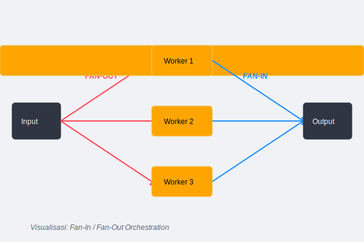
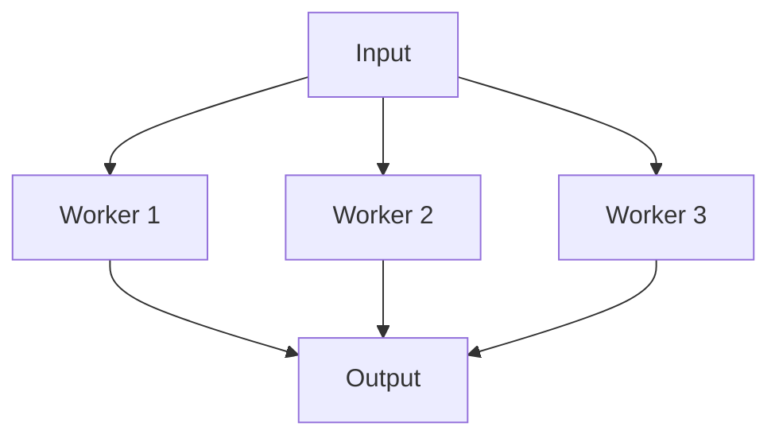

# CH-02: Fan-In and Fan-Out

## 1. Tahap 1: Source Alignment dan Judul

- **Source Link**: [Go Blog: Pipelines and cancellation](https://go.dev/blog/pipelines)
- **Framing**: Pola ini dipakai saat satu aliran kerja perlu dipecah ke banyak worker, lalu hasilnya dikumpulkan kembali ke satu jalur output.

## 2. Tahap 2: Konsep dan Rasionalitas

### Definisi
- **Fan-Out**: menyebarkan beban dari satu sumber input ke beberapa worker paralel.
- **Fan-In**: menggabungkan keluaran dari beberapa worker atau channel kembali ke satu jalur output.

### Rasionalitas
Pola ini dipilih karena:

1. **Pemrosesan paralel lebih mudah diatur**  
   Satu sumber kerja bisa dibagi ke beberapa unit eksekusi tanpa mengubah kontrak input utamanya.
2. **Hasil bisa digabung lagi secara terstruktur**  
   Output dari banyak worker tetap bisa disatukan ke satu channel konsumsi.
3. **Cocok untuk sistem streaming dan batch**  
   Pattern ini sering muncul saat throughput perlu dinaikkan tanpa mengubah bentuk data secara total.

### Analogi Model Mental
Bayangkan satu truk besar menurunkan banyak paket ke pusat distribusi. Paket itu lalu disebar ke beberapa kurir sekaligus untuk diproses. Setelah selesai, semua hasil pengiriman dikumpulkan lagi ke pusat pelaporan yang sama.

### Terminologi Teknis
- **Merge Channel**: channel gabungan tempat hasil banyak worker dikumpulkan.
- **Parallel Worker Set**: sekumpulan goroutine yang memproses input yang sama secara paralel.
- **Coordination Barrier**: mekanisme seperti `sync.WaitGroup` untuk memastikan semua jalur selesai sebelum output ditutup.

## 3. Tahap 3: Visualisasi Sistem

## 4. Tahap 4: Mekanisme Pembuktian

Di Go, fan-out sering dibangun dengan banyak goroutine yang membaca dari sumber input yang sama. Fan-in biasanya dibangun dengan goroutine tambahan yang meneruskan hasil dari beberapa channel ke satu output channel, lalu menutup output itu saat semua sumber selesai.

Nilai arsitekturnya:
- distribusi kerja dan penggabungan hasil bisa dipisahkan;
- scaling horizontal lebih mudah dimodelkan;
- alur data paralel tetap bisa dibaca sebagai satu sistem utuh.

## 5. Tahap 5: Lab Praktis

Lihat pembuktian kode di folder [examples/](./examples):
- [01_fanout_processing.go](./examples/01_fanout_processing.go) - Contoh fan-out dari satu input channel ke beberapa worker, lalu hasilnya difan-in kembali.

---
*Status: [x] Complete*
