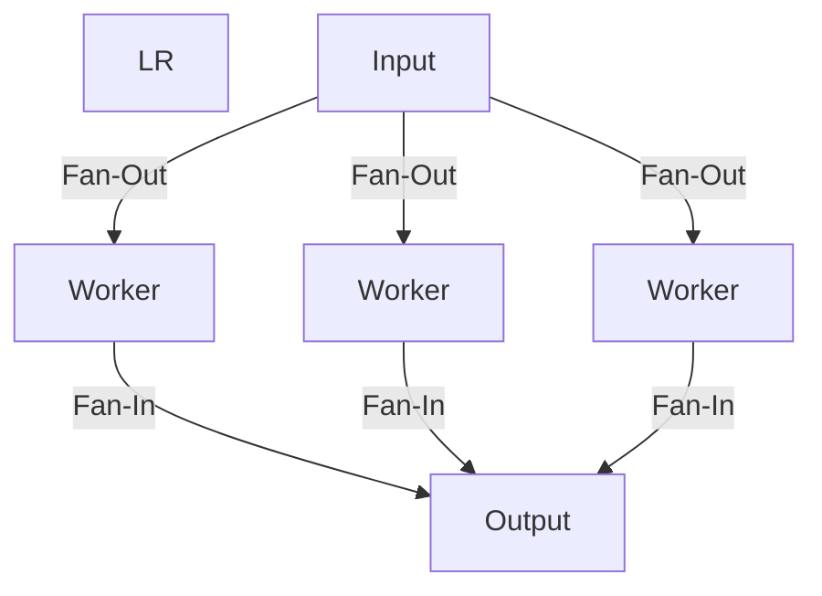

# CH-02: Fan-In / Fan-Out (Parallel Orchestration)

> **Source Link**: [Go Blog: Go Concurrency Patterns: Pipelines and cancellation](https://blog.golang.org/pipelines)

## 1. Konsep & Esensi (Definisi & Rasionalitas)

### Definisi ("Apa itu?")
- **Fan-Out**: Memulai banyak goroutine untuk menangani input dari sebuah channel tunggal secara paralel.
- **Fan-In**: Mengumpulkan hasil dari banyak channel ke dalam satu channel output terpadu.

### Rasionalitas ("Why & How?")
1. **Throughput**: Memanfaatkan CPU multi-core secara maksimal untuk tugas-tugas intensif (misal: pengolahan gambar, enkripsi).
2. **Latency Reduction**: Menyelesaikan tugas besar dengan memecahnya menjadi sub-tugas kecil yang berjalan simultan.

### Analogi Model Mental
- **Fan-Out**: Tim pembersih lapangan. Masuk ke lapangan lewat satu pintu, lalu berpencar (**Fan-Out**) ke seluruh sudut lapangan untuk menyisir sampah.
- **Fan-In**: Semua sampah yang dikumpulkan dibawa kembali ke satu truk pengangkut (**Fan-In**) di pintu keluar.

---

## 2. Visualisasi Sistem (Mermaid & SVG)

### Fan Orchestration (SVG)

### Alur Kerja Paralel (Mermaid)

---

## 3. Mekanisme Pembuktian (Algoritma Detil)
Mekanisme Fan-In biasanya menggunakan `sync.WaitGroup` untuk menunggu semua worker selesai dan menutup channel output. Alternatifnya, fungsi `merge` membuat goroutine tambahan untuk memantau status semua input channel.

---

## 4. Lab Praktis (Examples)
Silakan tinjau folder [examples/](./examples) untuk eksperimen berikut:
- `01_fanout_processing.go`: Simulasi pemrosesan data masif secara paralel.
- `02_fanin_merge.go`: Fungsi utilitas untuk menggabungkan hasil dari banyak channel.

---
*Unit ini memenuhi standar Platinum Gold (PPM V4).*
