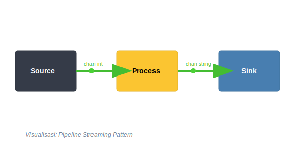
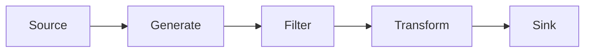

# CH-03: Pipeline Pattern

## 1. Tahap 1: Source Alignment dan Judul

- **Source Link**: [Go Blog: Pipelines and cancellation](https://go.dev/blog/pipelines)
- **Framing**: Pipeline pattern dipakai saat data perlu mengalir melewati beberapa tahap pemrosesan yang saling terhubung tetapi tetap punya tanggung jawab terpisah.

## 2. Tahap 2: Konsep dan Rasionalitas

### Definisi
Pipeline adalah rangkaian stage di mana setiap stage menerima data dari input channel, mengolahnya, lalu meneruskan hasilnya ke output channel untuk stage berikutnya.

### Rasionalitas
Pola ini dipilih karena:

1. **Stage mudah dikomposisikan**  
   Tiap tahap bisa dikembangkan, diganti, atau diuji secara terpisah.
2. **Data bisa diproses sambil mengalir**  
   Kita tidak perlu menunggu seluruh batch selesai sebelum tahap berikutnya mulai bekerja.
3. **Alur kerja lebih mudah dipahami**  
   Pembaca bisa melihat jalur data dari sumber sampai hasil akhir secara bertahap.

### Analogi Model Mental
Bayangkan lini perakitan. Satu tim memasang rangka, tim berikutnya memasang komponen, lalu tim lain mengecat hasilnya. Produk bergerak terus dari satu tahap ke tahap berikutnya sampai selesai.

### Terminologi Teknis
- **Stage**: satu unit pemrosesan dalam pipeline.
- **Stream Processing**: data diproses saat mengalir, bukan menunggu batch penuh selesai.
- **Backpressure**: tekanan saat stage berikutnya lebih lambat sehingga aliran sebelumnya ikut tertahan.

## 3. Tahap 3: Visualisasi Sistem

## 4. Tahap 4: Mekanisme Pembuktian

Di Go, setiap stage biasanya direpresentasikan sebagai fungsi yang menerima channel input dan mengembalikan channel output. Setiap stage berjalan di goroutine-nya sendiri, lalu sinkronisasi terjadi secara alami lewat operasi kirim dan terima pada channel.

Untuk `RAK-04`, yang penting dipahami adalah:
- pipeline membagi tanggung jawab pemrosesan menjadi blok berurutan;
- antar stage tidak perlu saling tahu detail internal;
- cancellation atau penghentian dini perlu dipikirkan agar pipeline tidak meninggalkan goroutine yang menggantung.

## 5. Tahap 5: Lab Praktis

Lihat pembuktian kode di folder [examples/](./examples):
- [01_data_pipeline.go](./examples/01_data_pipeline.go) - Contoh pipeline sederhana dari generator ke filter lalu transformasi hasil.

---
*Status: [x] Complete*
