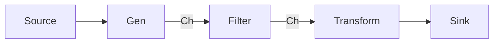

# CH-03: Pipeline Pattern (Stream Data Processing)

> **Source Link**: [Go Blog: Pipelines and cancellation](https://blog.golang.org/pipelines)

## 1. Konsep & Esensi (Definisi & Rasionalitas)

### Definisi ("Apa itu?")
Pipeline adalah serangkaian tahapan (stages) di mana setiap tahap melakukan tugas tertentu dan meneruskan hasilnya ke tahap berikutnya melalui channel.

### Rasionalitas ("Why & How?")
1. **Composability**: Setiap tahap pipeline adalah unit logika independen yang bisa diganti-ganti seperti Lego.
2. **Continuous Processing**: Data bisa diproses segera setelah tersedia di tahap sebelumnya tanpa menunggu seluruh batch selesai.
3. **Graceful Cancellation**: Dengan mengintegrasikan sistem pembatalan (seperti `done` channel), seluruh pipeline bisa dihentikan secara aman tanpa kebocoran memori.

### Analogi Model Mental
Bayangkan sebuah **Baris Perakitan Mobil (Assembly Line)**.
- Tahap 1: Memasang Rangka.
- Tahap 2: Memasang Mesin.
- Tahap 3: Pengecatan.
Saat mobil A sedang dicat, mobil B sedang dipasang mesin, dan mobil C mulai dipasang rangka. Pekerjaan mengalir terus-menerus (**Stream**).

---

## 2. Visualisasi Sistem (Mermaid & SVG)

### Streaming Pipeline (SVG)

### Alur Data Stages (Mermaid)

---

## 3. Mekanisme Pembuktian (Algoritma Detil)
Setiap tahap pipeline direpresentasikan oleh sebuah fungsi yang mengambil channel input dan mengembalikan channel output. Penggunaan channel unbuffered memastikan sinkronisasi natural antar tahap, namun penggunaan buffered channel bisa meningkatkan throughput jika ada ketimpangan kecepatan antar tahap.

---

## 4. Lab Praktis (Examples)
Silakan tinjau folder [examples/](./examples) untuk eksperimen berikut:
- `01_data_pipeline.go`: Mengolah data angka dari generator hingga filter genap.
- `02_pipeline_cancellation.go`: Menghentikan pipeline di tengah jalan dengan aman.

---
*Unit ini memenuhi standar Platinum Gold (PPM V4).*
