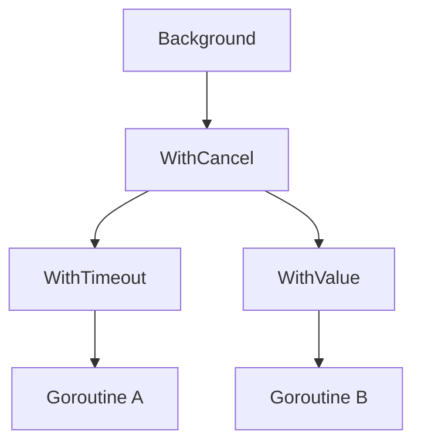

# CH-04: Context Pattern

## 1. Tahap 1: Source Alignment dan Judul

- **Source Link**: [Go Blog: Go Concurrency Patterns: Context](https://go.dev/blog/context) | [context package](https://pkg.go.dev/context)
- **Framing**: Context pattern penting saat banyak goroutine perlu berbagi sinyal pembatalan, batas waktu, atau metadata permintaan tanpa saling menggantung.

## 2. Tahap 2: Konsep dan Rasionalitas

### Definisi
`context.Context` adalah mekanisme standar di Go untuk membawa sinyal cancellation, deadline, timeout, dan request-scoped values melintasi batas fungsi dan goroutine.

### Rasionalitas
Pola ini dipilih karena:

1. **Lifecycle kerja jadi terkendali**  
   Operasi yang sudah tidak relevan bisa dihentikan lebih cepat.
2. **Timeout dan deadline jadi seragam**  
   Banyak komponen bisa mengikuti batas waktu yang sama tanpa protokol buatan sendiri.
3. **Propagasi lintas lapisan lebih rapi**  
   Context bisa diteruskan dari request masuk sampai ke dependency di bawahnya.

### Analogi Model Mental
Bayangkan regu lapangan yang membawa radio komando. Selama radio masih aktif, mereka lanjut bekerja. Jika komando pembatalan dikirim, semua unit yang mendengar sinyal itu harus berhenti dan kembali.

### Terminologi Teknis
- **Cancellation Signal**: tanda bahwa pekerjaan harus dihentikan.
- **Deadline / Timeout**: batas waktu mutlak atau relatif untuk suatu operasi.
- **Propagation**: pewarisan sinyal dan nilai dari context induk ke turunan.

## 3. Tahap 3: Visualisasi Sistem

## 4. Tahap 4: Mekanisme Pembuktian

Di Go, context membentuk rantai parent-child. Ketika context induk dibatalkan, semua turunan yang bergantung padanya ikut menerima sinyal yang sama lewat `Done()`. Karena sifatnya kooperatif, tiap goroutine tetap perlu memeriksa context secara sadar, biasanya lewat `select`.

Nilai arsitekturnya di `RAK-04`:
- pembatalan tidak diatur dengan channel custom di setiap tempat;
- koordinasi lintas goroutine dan batas API jadi lebih konsisten;
- resource leak lebih mudah dicegah karena pekerjaan punya lifecycle yang jelas.

## 5. Tahap 5: Lab Praktis

Lihat pembuktian kode di folder [examples/](./examples):
- [01_context_timeout.go](./examples/01_context_timeout.go) - Contoh timeout sederhana untuk menghentikan operasi yang berjalan terlalu lama.

---
*Status: [x] Complete*
