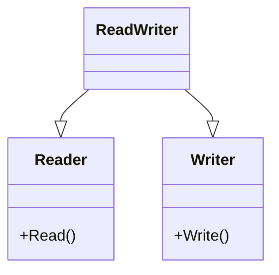

# CH-01: Interface Composition

## 1. Tahap 1: Source Alignment dan Judul

- **Source Link**: [Go Spec: Interface types](https://go.dev/ref/spec#Interface_types) | [Effective Go: Interfaces and other types](https://go.dev/doc/effective_go#interfaces_and_types)
- **Framing**: Di Go, interface besar biasanya tidak ditulis dari awal. Yang lebih umum adalah mulai dari interface kecil, lalu menggabungkannya saat benar-benar dibutuhkan.

## 2. Tahap 2: Konsep dan Rasionalitas

### Definisi
Interface composition adalah teknik membentuk interface yang lebih kaya dengan menggabungkan beberapa interface kecil yang masing-masing mewakili satu tanggung jawab.

### Rasionalitas
Pola ini dipilih karena:

1. **Kontrak jadi lebih kecil dan jelas**  
   Tipe cukup memenuhi perilaku yang memang dibutuhkan, bukan sekumpulan metode yang terlalu lebar.
2. **Komposisi lebih fleksibel**  
   Interface kecil bisa dipakai ulang dalam banyak kombinasi berbeda.
3. **Abstraksi lebih kuat**  
   Di Go, interface yang kecil biasanya lebih tahan perubahan daripada interface besar yang mencoba merangkum semuanya sekaligus.

### Analogi Model Mental
Bayangkan toolkit. Ada obeng, tang, dan kunci pas sebagai alat-alat kecil yang punya fungsi spesifik. Kalau suatu pekerjaan butuh dua fungsi sekaligus, kita tinggal membawa kombinasi alat yang tepat, bukan memaksa semua pekerjaan memakai satu alat raksasa.

### Terminologi Teknis
- **Method Set**: kumpulan metode yang menentukan apakah suatu tipe memenuhi interface tertentu.
- **Embedded Interface**: interface yang dimasukkan ke interface lain untuk membentuk kontrak gabungan.
- **Behavior Contract**: kontrak perilaku yang diminta dari pemakai interface.

## 3. Tahap 3: Visualisasi Sistem

## 4. Tahap 4: Mekanisme Pembuktian

Di level bahasa, interface composition bukan inheritance. Go hanya menggabungkan daftar metode yang dibutuhkan. Saat sebuah tipe punya method set yang lengkap, tipe itu otomatis memenuhi interface gabungan tersebut.

Yang penting untuk `RAK-04`:
- kita tidak sedang membangun hierarki kelas;
- kita sedang menyusun kontrak perilaku dari blok kecil;
- komposisi ini membuat desain tetap modular tanpa menambah coupling yang tidak perlu.

## 5. Tahap 5: Lab Praktis

Lihat pembuktian kode di folder [examples/](./examples):
- [01_io_composition.go](./examples/01_io_composition.go) - Simulasi komposisi interface kecil menjadi kontrak `ReadWriter` yang lebih kaya.

---
*Status: [x] Complete*
