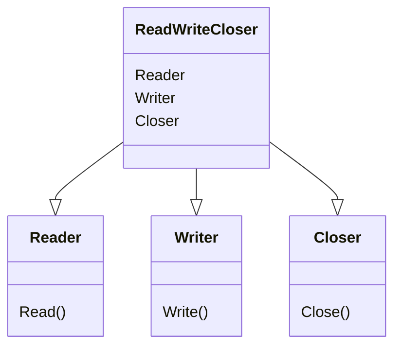

# CH-01: Interface Composition (Building Blocks)

> **Source Link**: [The Go Programming Language Specification - Interface types](https://golang.org/ref/spec#Interface_types) | [Go Blog: Go Interfaces](https://blog.golang.org/interfaces)

## 1. Konsep & Esensi (Definisi & Rasionalitas)

### Definisi ("Apa itu?")
Interface Composition adalah teknik menggabungkan beberapa interface kecil (atomic interfaces) menjadi satu interface yang lebih besar.

### Rasionalitas ("Why & How?")
1. **Granularity**: Interface kecil lebih mudah dipenuhi oleh tipe data sederhana.
2. **Reusability**: Kita bisa mengombinasikan "perilaku" (behaviors) secara modular.
3. **Mantra Go**: *"The bigger the interface, the weaker the abstraction."* (Rob Pike). Abstraksi yang paling kuat adalah yang paling kecil dan spesifik.

### Analogi Model Mental
Bayangkan sebuh **Peralatan Multifungsi (Swiss Army Knife)**.
Interface kecil adalah **Pisau**, **Gunting**, dan **Pembuka Botol**. Kita bisa memiliki interface besar bernama **MultiTool** yang merupakan kombinasi dari ketiganya. Jika kita hanya butuh memotong kertas, kita cukup meminta tipe yang memenuhi interface `Gunting`, bukan keseluruhan `MultiTool`.

---

## 2. Visualisasi Sistem (Mermaid)

---

## 3. Mekanisme Pembuktian (Algoritma Detil)
Di bawah kap mesin, interface yang dikomposisi hanyalah daftar metode yang digabungkan. Go tidak menyimpan hierarki antara interface induk dan anak; yang penting adalah apakah sebuah tipe memiliki set metode yang lengkap untuk interface target.

---

## 4. Lab Praktis (Examples)
Silakan tinjau folder [examples/](./examples) untuk eksperimen berikut:
- `01_io_composition.go`: Simulasi pola `io.ReadWriter` dalam kode nyata.
- `02_custom_composition.go`: Membuat kontrak API sendiri dengan komposisi.

---
*Unit ini memenuhi standar Platinum Gold (PPM V4).*
