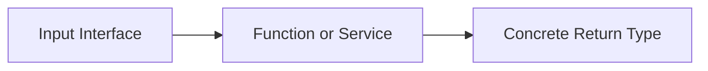

# CH-02: Accept Interfaces, Return Structs

## 1. Tahap 1: Source Alignment dan Judul

- **Source Link**: [Go Wiki: Code Review Comments - Interfaces](https://go.dev/wiki/CodeReviewComments#interfaces) | [Effective Go: Interfaces and other types](https://go.dev/doc/effective_go#interfaces_and_types)
- **Framing**: Ini salah satu nasihat desain API yang paling sering dipakai di ekosistem Go: input dibuat fleksibel lewat interface, tetapi output dijaga konkret supaya mudah dipakai.

## 2. Tahap 2: Konsep dan Rasionalitas

### Definisi
Prinsip ini berarti fungsi atau komponen sebaiknya menerima interface pada sisi input ketika hanya perilaku tertentu yang dibutuhkan, lalu mengembalikan tipe konkret pada sisi output agar hasilnya jelas dan mudah digunakan pemanggil.

### Rasionalitas
Pola ini dipilih karena:

1. **Input lebih fleksibel**  
   Fungsi bisa menerima berbagai tipe selama semuanya memenuhi kontrak perilaku yang sama.
2. **Output lebih jelas**  
   Pemanggil tahu persis apa yang dikembalikan dan tidak perlu menebak kapabilitas tersembunyi di balik interface hasil return.
3. **Desain interface jadi lebih disiplin**  
   Interface dibuat saat benar-benar dibutuhkan oleh consumer, bukan dipaksakan terlalu dini.

### Analogi Model Mental
Bayangkan loket layanan. Petugas menerima banyak bentuk identitas selama semuanya memenuhi syarat verifikasi tertentu. Tetapi saat selesai, petugas memberikan hasil yang konkret, misalnya kartu fisik atau dokumen final, bukan "sesuatu yang mirip hasil".

### Terminologi Teknis
- **Consumer-side Interface**: interface kecil yang didefinisikan oleh pihak yang memakai dependency.
- **Concrete Return Type**: hasil return berupa tipe nyata yang method set-nya jelas.
- **Premature Abstraction**: abstraksi yang dibuat terlalu cepat sebelum kebutuhan nyatanya terlihat.

## 3. Tahap 3: Visualisasi Sistem

## 4. Tahap 4: Mekanisme Pembuktian

Di Go, interface sangat ringan karena kepuasannya implisit. Itu membuat sisi input cocok memakai interface kecil. Namun untuk sisi output, tipe konkret sering lebih berguna karena:
- caller melihat kemampuan penuh objek yang dikembalikan;
- dokumentasi API jadi lebih jelas;
- evolusi implementasi internal tetap bisa dijaga tanpa menyembunyikan terlalu banyak hal di balik return interface.

Poin pentingnya bukan "selalu" mengembalikan struct dalam semua kasus, tetapi bahwa abstraksi di sisi return harus dipakai dengan alasan yang benar-benar kuat.

## 5. Tahap 5: Lab Praktis

Lihat pembuktian kode di folder [examples/](./examples):
- [01_flexible_input.go](./examples/01_flexible_input.go) - Contoh fungsi yang menerima interface kecil agar input tetap fleksibel.

---
*Status: [x] Complete*
