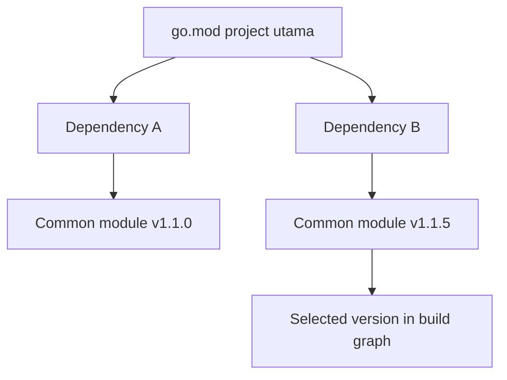

# CH-01: Go Modules Internals

## 1. Tahap 1: Source Alignment dan Judul

- **Source Link**: [Using Go Modules](https://go.dev/blog/using-go-modules) | [Go Modules Reference](https://go.dev/ref/mod)
- **Framing**: Go modules membuat dependency workflow di Go terasa rapi karena identitas modul, versi, dan integritas dependency dicatat dengan aturan yang jelas.

## 2. Tahap 2: Konsep dan Rasionalitas

### Definisi
Go modules adalah sistem resmi Go untuk mendefinisikan identitas project, mengelola versi dependency, dan menjaga build tetap reproducible melalui file seperti `go.mod` dan `go.sum`.

### Rasionalitas
Pola ini dipilih karena:

1. **Build jadi reproducible**  
   Tim bisa membangun project dengan dependency graph yang konsisten, bukan bergantung pada isi folder lokal masing-masing.
2. **Versi dependency dikelola dengan aturan jelas**  
   Toolchain memakai mekanisme seperti Minimal Version Selection agar pemilihan versi tidak berubah-ubah secara liar.
3. **Workflow engineering lebih aman**  
   Checksum dan metadata module membantu menjaga integritas dependency yang dipakai dalam build.

### Analogi Model Mental
Bayangkan resep dapur profesional. Bukan cuma daftar bahan yang dicatat, tetapi juga takaran dan pemasoknya. Dengan begitu, hasil masakan bisa diulang dengan rasa yang sama di dapur yang berbeda.

### Terminologi Teknis
- **Module Path**: identitas unik modul.
- **Minimal Version Selection (MVS)**: strategi Go untuk memilih versi dependency yang dipakai dalam graph.
- **Checksum Verification**: validasi integritas isi dependency terhadap catatan checksum.

## 3. Tahap 3: Visualisasi Sistem

## 4. Tahap 4: Mekanisme Pembuktian

Di Go, `go.mod` menyimpan identitas modul dan requirement utama. Saat build atau test dijalankan, toolchain menyusun dependency graph lalu memutuskan versi yang dipakai berdasarkan aturan module system.

Yang penting untuk `RAK-04`:
- module workflow adalah bagian dari engineering architecture, bukan sekadar file konfigurasi;
- dependency resolution dibuat eksplisit dan bisa diaudit;
- perubahan dependency tidak dibiarkan menjadi efek samping yang tersembunyi.

`go.sum` berperan sebagai bukti integritas dependency yang pernah dipakai. Jadi walaupun contoh di bawah fokus pada struktur `go.mod` dan `replace` lokal, model mentalnya tetap sama: dependency harus eksplisit, bisa diverifikasi, dan mudah diulang.

## 5. Tahap 5: Lab Praktis

Lihat pembuktian di folder [examples/](./examples):
- [01_basic_module](./examples/01_basic_module) - Modul Go paling sederhana untuk melihat peran `module` dan `go` directive.
- [02_local_replace](./examples/02_local_replace) - Dua modul lokal dengan `require` dan `replace` untuk menunjukkan wiring dependency yang eksplisit.

---
*Status: [x] Complete*
