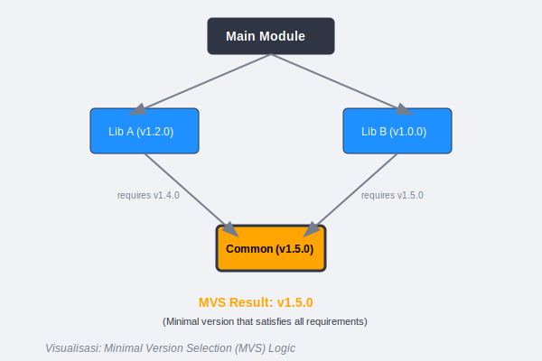

# CH-01: Go Modules Internals (Dependency Management)

> **Source Link**: [Go Blog: Go Modules](https://blog.golang.org/using-go-modules) | [Go Reference: Go Modules Reference](https://golang.org/ref/mod)

## 1. Konsep & Esensi (Definisi & Rasionalitas)

### Definisi ("Apa itu?")
Go Modules adalah sistem manajemen dependensi resmi Go sejak versi 1.11. Ia mengelola versi library, memastikan build yang reproduktif, dan memutus ketergantungan pada variabel lingkungan `$GOPATH`.

### Rasionalitas ("Why & How?")
1. **Reproducibility**: File `go.sum` memastikan semua orang di tim menggunakan kode yang sama dengan checksum yang identik (Anti-Fraud).
2. **MVS (Minimal Version Selection)**: Algoritma unik Go untuk memilih versi dependensi tertua yang masih memenuhi syarat (paling stabil), bukannya versi terbaru yang berisiko breaking changes.
3. **Semantic Import Versioning**: Memungkinkan penggunaan v2 atau v3 dari library yang sama dalam satu proyek dengan path import yang berbeda.

### Analogi Model Mental
Bayangkan sebuah **Resep Masakan**.
- **GOPATH era**: Resep hanya bilang "Gunakan Garam". Anda bisa saja pakai Garam Laut atau Garam Meja, terserah apa yang ada di dapur. Hasilnya rasa masakan bisa beda-beda.
- **Go Modules**: Resep bilang "Gunakan Garam Merek X, Versi 1.2, Batch #55". Jika garamnya beda sedikit saja (**Checksum mismatch**), masak tidak akan dimulai. Hasil masakan pasti sama persis di mana pun.

---

## 2. Visualisasi Sistem (Mermaid & SVG)

### Resolusi Versi (SVG)


### Alur Dependency (Mermaid)
```mermaid
graph TD

    M[Project: go.mod] --> D1[Library A v1.0.0]
    M --> D2[Library B v1.2.3]
    D1 --> D3[Common Lib v1.1.0]
    D2 --> D4[Common Lib v1.1.5]
    Note over M: MVS selects Common Lib v1.1.5
```

---

## 3. Mekanisme Pembuktian (Algoritma Detil)
Go menggunakan file `go.mod` untuk deklarasi meta-data dan `go.sum` untuk integritas data. Saat `go build` dijalankan, toolchain Go akan men-download modul ke cache lokal (`$GOPATH/pkg/mod`) dan memverifikasi isinya terhadap `go.sum`.

---

## 4. Lab Praktis (Examples)
Silakan tinjau folder [examples/](./examples) untuk eksperimen berikut:
- `01_mod_init.go`: Memulai modul dan menambah dependensi.
- `02_version_conflict.go`: Melihat bagaimana Go menangani perbedaan versi dependensi.

---
*Unit ini memenuhi standar Platinum Gold (PPM V4).*
