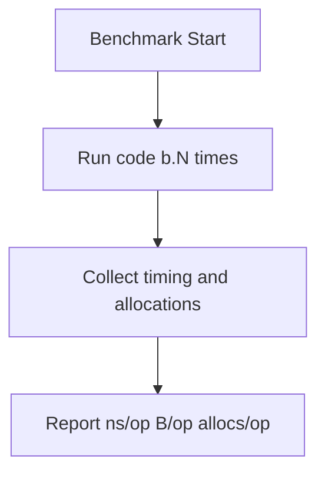

# CH-01: Micro Benchmarking

## 1. Tahap 1: Source Alignment dan Judul

- **Source Link**: [testing package: Benchmarks](https://pkg.go.dev/testing#hdr-Benchmarks) | [Go Wiki: Performance](https://go.dev/wiki/Performance)
- **Framing**: Microbenchmark dipakai saat kita ingin membuktikan apakah perubahan kecil di kode benar-benar memperbaiki performa, bukan cuma terasa lebih cepat.

## 2. Tahap 2: Konsep dan Rasionalitas

### Definisi
Microbenchmark adalah pengukuran performa pada unit kode kecil menggunakan benchmark runner bawaan Go melalui `go test -bench`.

### Rasionalitas
Pola ini dipilih karena:

1. **Optimasi bisa dibuktikan dengan angka**  
   Perubahan implementasi bisa dibandingkan lewat `ns/op`, `B/op`, dan `allocs/op`.
2. **Regresi performa lebih mudah terlihat**  
   Area sensitif bisa dipantau sebelum perubahan menyebar ke sistem yang lebih besar.
3. **Keputusan teknis jadi lebih objektif**  
   Diskusi performa tidak berhenti di asumsi atau rasa-rasa.

### Analogi Model Mental
Bayangkan dua mobil diuji di lintasan yang sama berulang kali. Yang dicatat bukan cuma siapa yang menang sekali, tetapi rata-rata waktu tempuh dan konsumsi bahan bakarnya dalam kondisi yang setara.

### Terminologi Teknis
- **`b.N`**: jumlah iterasi yang disesuaikan otomatis oleh benchmark runner.
- **`ns/op`**: rata-rata waktu per operasi.
- **`allocs/op`**: jumlah alokasi per operasi benchmark.

## 3. Tahap 3: Visualisasi Sistem

## 4. Tahap 4: Mekanisme Pembuktian

Tool benchmark Go menaikkan nilai `b.N` secara otomatis sampai hasil pengukuran dianggap cukup stabil. Dengan begitu, pembandingan tidak bergantung pada satu eksekusi pendek yang mudah dipengaruhi noise.

Nilai arsitekturnya di `RAK-04`:
- benchmark membantu memilih implementasi berdasarkan data;
- pengukuran kecil bisa mencegah salah arah optimasi;
- alokasi dan waktu eksekusi bisa dilihat sejak level unit, sebelum masalah membesar di sistem penuh.

## 5. Tahap 5: Lab Praktis

Lihat pembuktian kode di folder [examples/](./examples):
- [01_string_concat_test.go](./examples/01_string_concat_test.go) - Benchmark perbandingan konkatenasi string biasa dengan `strings.Builder`.

---
*Status: [x] Complete*
