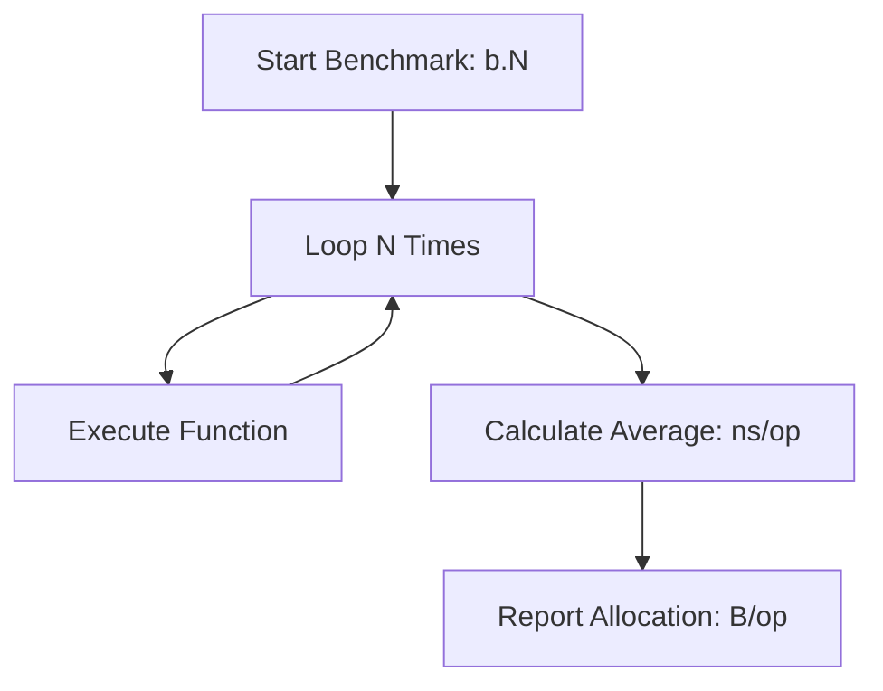

# CH-01: Micro Benchmarking (Performance Testing)

> **Source Link**: [Go Packages: testing - Benchmarks](https://golang.org/pkg/testing/#hdr-Benchmarks) | [Dave Cheney: High Performance Go Workshop](https://dave.cheney.net/high-performance-go-workshop/dotgo-paris.html)

## 1. Konsep & Esensi (Definisi & Rasionalitas)

### Definisi ("Apa itu?")
Micro Benchmarking adalah teknik untuk mengukur waktu eksekusi dan alokasi memori dari sebuah unit kode kecil menggunakan toolchain bawaan Go (`go test -bench`).

### Rasionalitas ("Why & How?")
1. **Optimization Evidence**: Membuktikan secara matematis bahwa sebuah refactor benar-benar meningkatkan performa.
2. **Allocation Monitoring**: Mendeteksi alokasi memori yang tidak perlu (Escape Analysis issues) yang bisa membebani Garbage Collector.
3. **Regression Prevention**: Memastikan fitur baru tidak memperlambat area kritis sistem.

### Analogi Model Mental
Bayangkan sebuah **Balapan Formula 1**.
`go test` biasa adalah tes kelaikan jalan (Apakah rem berfungsi? Apakah setir bisa belok?). Sementara **Benchmarking** adalah tes kecepatan di sirkuit. Kita mengukur berapa milidetik yang dibutuhkan untuk satu lap (**b.N**) dan berapa banyak bensin yang dihabiskan (**Allocs/op**).

---

## 2. Visualisasi Sistem (Mermaid)

---

## 3. Mekanisme Pembuktian (Algoritma Detil)
Go menjalankan benchmark beberapa kali dengan nilai `b.N` yang terus bertambah secara otomatis hingga durasi total mencapai target (biasanya 1 detik). Ini memastikan hasil rata-rata yang stabil dari noise sistem operasi.

---

## 4. Lab Praktis (Examples)
Silakan tinjau folder [examples/](./examples) untuk eksperimen berikut:
- `01_string_concat.go`: Perbandingan `+` vs `strings.Builder`.
- `02_slice_prealloc.go`: Dampak `make([]T, n, c)` terhadap performa.

---
*Unit ini memenuhi standar Platinum Gold (PPM V4).*
