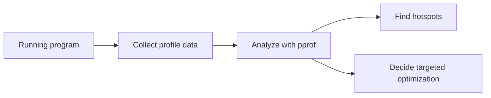

# CH-02: Profiling Strategies

## 1. Tahap 1: Source Alignment dan Judul

- **Source Link**: [Go Blog: Profiling Go Programs](https://go.dev/blog/profiling-go-programs) | [runtime/pprof package](https://pkg.go.dev/runtime/pprof)
- **Framing**: Profiling dipakai saat benchmark sudah menunjukkan ada masalah, lalu kita perlu tahu bagian mana dari program yang benar-benar menghabiskan waktu atau resource.

## 2. Tahap 2: Konsep dan Rasionalitas

### Definisi
Profiling adalah proses mengumpulkan data runtime tentang CPU, memori, blocking, atau perilaku eksekusi lain untuk menemukan bottleneck nyata di program.

### Rasionalitas
Pola ini dipilih karena:

1. **Hot spot bisa ditemukan lebih cepat**  
   Kita tidak perlu menebak-nebak fungsi mana yang paling mahal.
2. **Biaya resource jadi terlihat**  
   Profil membantu menunjukkan apakah masalah datang dari CPU, alokasi, atau pola blocking.
3. **Optimasi jadi lebih terarah**  
   Perubahan dilakukan pada titik yang benar-benar terbukti bermasalah.

### Analogi Model Mental
Bayangkan pemeriksaan kesehatan lengkap. Benchmark memberi tahu bahwa pasien "terasa lambat", tetapi profiling menunjukkan apakah penyebabnya ada di jantung, paru-paru, atau pola gerak hariannya.

### Terminologi Teknis
- **CPU Profile**: sampel penggunaan CPU selama program berjalan.
- **Heap Profile**: gambaran alokasi atau objek yang hidup di memori.
- **Trace**: rekaman event runtime yang menunjukkan alur eksekusi lebih detail.

## 3. Tahap 3: Visualisasi Sistem

## 4. Tahap 4: Mekanisme Pembuktian

Profiling di Go umumnya bekerja dengan sampling atau pencatatan event runtime. Hasilnya kemudian dianalisis lewat tool seperti `pprof` untuk melihat fungsi yang paling sering muncul dalam jalur eksekusi mahal.

Yang perlu dijaga di `RAK-04`:
- profiling dipakai sebagai strategi engineering;
- fokusnya adalah menemukan bottleneck yang relevan untuk keputusan desain;
- kita belum masuk ke runtime forensics yang lebih cocok dibahas di `RAK-06`.

## 5. Tahap 5: Lab Praktis

Lihat pembuktian kode di folder [examples/](./examples):
- [01_cpu_profiling.go](./examples/01_cpu_profiling.go) - Contoh pengambilan CPU profile sederhana menggunakan `runtime/pprof`.

---
*Status: [x] Complete*
