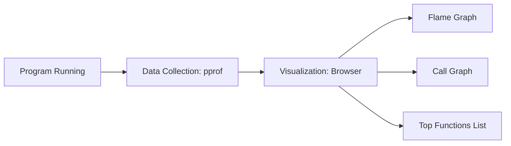

# CH-02: Profiling Strategies (Pprof & Traces)

> **Source Link**: [Go Packages: net/http/pprof](https://golang.org/pkg/net/http/pprof/) | [Go Blog: Profiling Go Programs](https://blog.golang.org/profiling-go-programs)

## 1. Konsep & Esensi (Definisi & Rasionalitas)

### Definisi ("Apa itu?")
Profiling adalah proses pengumpulan data statistik tentang penggunaan sumber daya selama program berjalan, seperti CPU, Memori, Blokir Goroutine, dan Mutex Contention. Go menyediakan tool `pprof` (visualisasi) dan `trace` (linimasa).

### Rasionalitas ("Why & How?")
1. **Identify Bottlenecks**: Mengetahui fungsi mana yang paling banyak memakan waktu CPU ("Hot Spots").
2. **GC Pressure Analysis**: Menemukan objek mana yang paling banyak dialokasikan dan menyebabkan jeda Garbage Collection.
3. **Deadlock Detection**: Menganalisis alasan goroutine menunggu terlalu lama (blocking analysis).

### Analogi Model Mental
Bayangkan **Pemeriksaan Kesehatan (Check-up) di Rumah Sakit**.
- **CPU Profile**: Seperti **Treadmill Test** (Melihat jantung saat bekerja keras).
- **Heap Profile**: Seperti **X-Ray** (Melihat apa yang ada di dalam perut/memori).
- **Execution Trace**: Seperti **Rekaman CCTV 24 Jam** (Melihat setiap pergerakan prajurit/goroutine dari detik ke detik).

---

## 2. Visualisasi Sistem (Mermaid)

---

## 3. Mekanisme Pembuktian (Algoritma Detil)
Profiling bekerja dengan melakukan sampling (pengambilan sampel) tumpukan stack secara berkala (default 100 kali per detik untuk CPU). Tool `trace` bekerja berbeda dengan mencatat setiap event perubahan status goroutine (Create, Context Switch, Block) secara presisi.

---

## 4. Lab Praktis (Examples)
Silakan tinjau folder [examples/](./examples) untuk eksperimen berikut:
- `01_collect_cpu_profile.go`: Cara membuat file profile CPU.
- `02_analyze_heap.go`: Mendeteksi "In-use" vs "Alloc" memory.

---
*Unit ini memenuhi standar Platinum Gold (PPM V4).*
