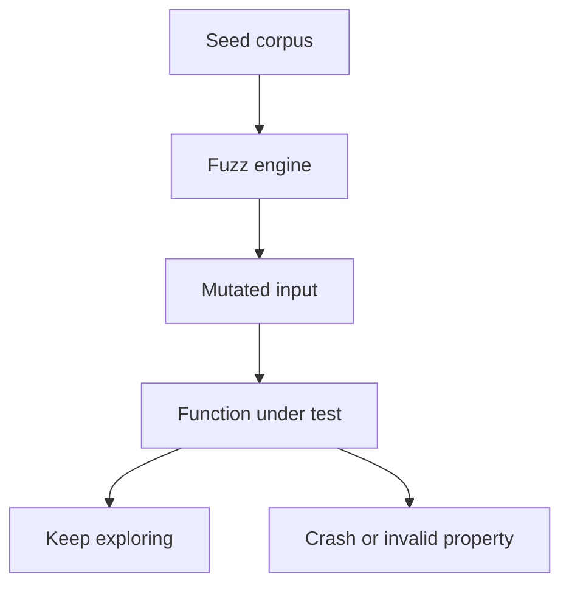

# CH-03: Fuzz Testing

## 1. Tahap 1: Source Alignment dan Judul

- **Source Link**: [Go Fuzzing Documentation](https://go.dev/doc/fuzz/) | [Go Blog: Fuzzing is Beta Ready](https://go.dev/blog/fuzz-beta)
- **Framing**: Fuzz testing dipakai saat unit test biasa sudah ada, tetapi kita ingin mendorong fungsi menerima input aneh untuk menemukan crash atau perilaku yang tidak terpikir sebelumnya.

## 2. Tahap 2: Konsep dan Rasionalitas

### Definisi
Fuzz testing adalah teknik pengujian otomatis yang memberi fungsi banyak variasi input untuk mencari panic, crash, atau hasil yang melanggar properti yang seharusnya tetap benar.

### Rasionalitas
Pola ini dipilih karena:

1. **Edge case lebih mudah ditemukan**  
   Input aneh yang luput dari tebakan manusia bisa muncul secara otomatis.
2. **Robustness meningkat**  
   Fungsi diuji terhadap variasi input yang jauh lebih liar daripada test biasa.
3. **Toolchain Go sudah mendukung langsung**  
   Fuzzing tidak perlu diperlakukan sebagai alat eksternal yang terpisah dari workflow test utama.

### Analogi Model Mental
Bayangkan sebuah jembatan yang tidak hanya dilewati mobil standar, tetapi juga diuji dengan beban dan bentuk yang tidak biasa untuk mencari titik lemah yang sebelumnya tersembunyi.

### Terminologi Teknis
- **Seed Corpus**: kumpulan input awal yang diberikan ke fuzzer.
- **Mutation**: perubahan otomatis pada input untuk membuka jalur perilaku baru.
- **Coverage-guided**: strategi fuzzer yang mengejar jalur eksekusi kode baru.

## 3. Tahap 3: Visualisasi Sistem

## 4. Tahap 4: Mekanisme Pembuktian

Fuzzer Go memulai dari corpus awal, lalu memodifikasi input untuk mencoba membuka jalur eksekusi baru. Jika menemukan input yang memicu kegagalan, input itu disimpan agar bisa direproduksi dan dianalisis.

Nilai arsitekturnya:
- pengujian tidak hanya bergantung pada skenario yang dibayangkan penulis;
- robustness bisa ditingkatkan lebih awal;
- fungsi yang tampak sederhana tetap diuji terhadap data yang tidak ramah.

## 5. Tahap 5: Lab Praktis

Lihat pembuktian kode di folder [examples/](./examples):
- [01_reverse_fuzz_test.go](./examples/01_reverse_fuzz_test.go) - Fuzz test sederhana untuk properti pembalikan string dan validitas UTF-8.

---
*Status: [x] Complete*
