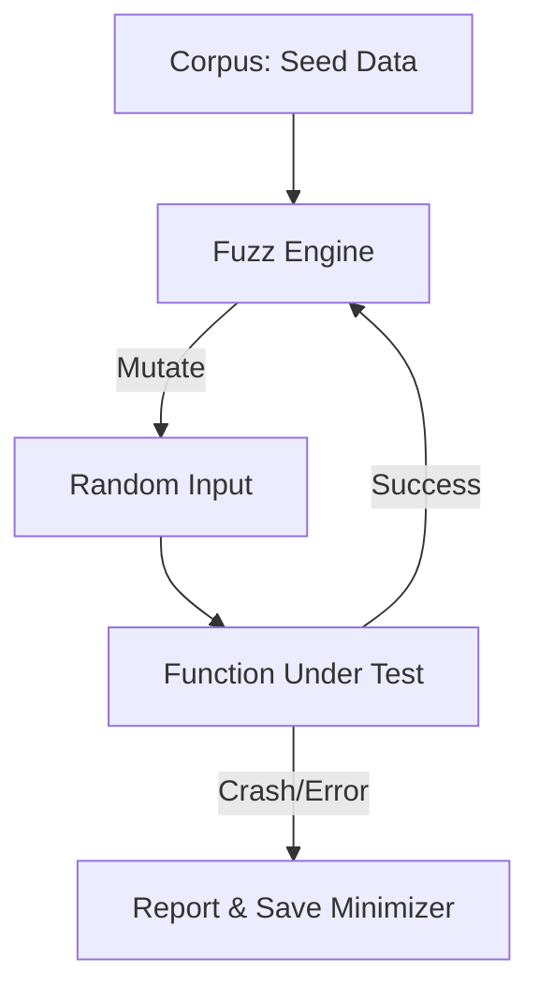

# CH-03: Fuzz Testing (Finding Corner Cases)

> **Source Link**: [Go Blog: Native Fuzzing in Go](https://go.dev/blog/fuzz-beta) | [Go Documentation: Go Fuzzing](https://go.dev/doc/fuzz/)

## 1. Konsep & Esensi (Definisi & Rasionalitas)

### Definisi ("Apa itu?")
Fuzzing adalah jenis pengujian otomatis yang secara terus-menerus memberikan input acak (random) ke fungsi Anda untuk menemukan input "beracun" yang menyebabkan crash, panic, atau hasil tidak valid.

### Rasionalitas ("Why & How?")
1. **Edge Case Discovery**: Manusia cenderung mengetes skenario yang "masuk akal". Fuzzer mengetes skenario gila yang sering dilewatkan (misal: string kosong, angka negatif ekstrem, karakter Unicode aneh).
2. **Security & Robustness**: Mencegah celah keamanan seperti *buffer overflow* atau *integer overflow* sebelum dieksploitasi di produksi.
3. **Industrial Standard**: Go adalah bahasa pertama yang menyertakan native fuzzing langsung di toolchain standard-nya.

### Analogi Model Mental
Bayangkan sedang **Mengetes Kekuatan Jembatan**.
- **Unit Test**: Anda mengirim mobil seberat 1 ton lewat. Jembatan aman.
- **Fuzz Test**: Seorang "Gila" datang melempar 1000 benda secara acak: tank baja, balon udara, gajah, hingga es batu cair. Tiba-tiba saat dilempar "pasir seberat 10 ton di satu titik", jembatan roboh. Fuzzer menemukan titik lemah yang tidak terpikirkan oleh insinyur.

---

## 2. Visualisasi Sistem (Mermaid)

---

## 3. Mekanisme Pembuktian (Algoritma Detil)
Fuzzing engine Go menggunakan model **Coverage-guided**. Artinya, ia memantau jalur kode (path) mana yang dieksekusi oleh input tertentu. Jika suatu input baru berhasil membuka jalur kode baru, input tersebut akan disimpan dan dikembangkan lagi (dimutasi) untuk mencoba mencapai jalur yang lebih dalam lagi.

---

## 4. Lab Praktis (Examples)
Silakan tinjau folder [examples/](./examples) untuk eksperimen berikut:
- `01_simple_fuzz.go`: Mengetes fungsi manipulasi string dengan `f.Fuzz`.
- `02_parsing_fuzz.go`: Fuzzing pada data JSON/Binary parser.

---
*Unit ini memenuhi standar Platinum Gold (PPM V4).*
