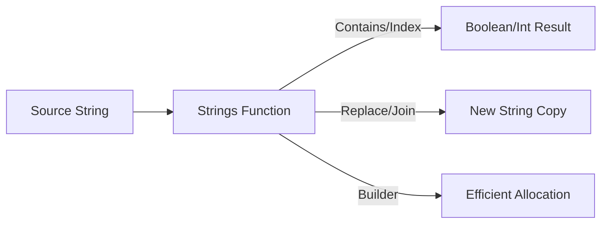

# CH-01: Strings Manipulation (High-Level Text)

> **Source Link**: [Go Packages: strings](https://golang.org/pkg/strings/) | [Go Blog: Strings, bytes, runes and characters](https://blog.golang.org/strings)

## 1. Konsep & Esensi (Definisi & Rasionalitas)

### Definisi ("Apa itu?")
Pakat `strings` menyediakan fungsi bantuan untuk manipulasi string UTF-8 yang efisien tanpa mengubah string asli (karena string di Go bersifat imutabel).

### Rasionalitas ("Why & How?")
1. **Efficiency**: Fungsi seperti `strings.Builder` mencegah alokasi memori berlebih saat penggabungan string skala besar.
2. **Standardization**: Menyediakan cara idiomatik untuk pemotongan, pencarian, dan penggantian teks yang aman terhadap karakter multi-byte (Unicode).
3. **ReadOnly Native**: Mengoptimalkan performa dengan memanfaatkan sifat *read-only* dari string Go.

### Analogi Model Mental
Bayangkan **Mesin Cetak**.
String asli adalah "Master Cetakan" yang tidak bisa diubah. Jika Anda ingin menambahkan teks ("Kopi") ke "Susu", pakat `strings` seperti **Tukang Cetak** yang mengambil cetakan "Susu", membuat salinan baru, menambahkan "Kopi", dan memberikan hasilnya kepada Anda.

---

## 2. Visualisasi Sistem (Mermaid)

---

## 3. Mekanisme Pembuktian (Algoritma Detil)
Go String secara internal adalah *header* berisi pointer ke data underlying dan panjang (*length*). Pakat `strings` beroperasi langsung pada slice byte underlying ini namun tetap menjamin integritas UTF-8. Penggunaan `strings.Builder` sangat disarankan karena ia meminimalkan penyalinan memori dengan mengalokasikan buffer internal yang tumbuh secara dinamis.

---

## 4. Lab Praktis (Examples)
Silakan tinjau folder [examples/](./examples) untuk eksperimen berikut:
- `01_search_replace.go`: Penggunaan `Contains`, `HasPrefix`, dan `ReplaceAll`.
- `02_string_builder.go`: Pembuktian efisiensi alokasi vs penggabungan `+`.

---
*Unit ini memenuhi standar Platinum Gold (PPM V4).*
