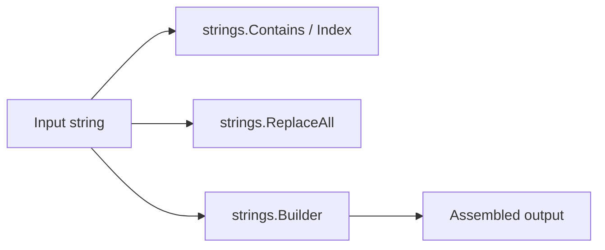

# CH-01: `strings` for High-Level Text Processing

## 1. Tahap 1: Source Alignment dan Judul

- **Source Link**: [strings package](https://pkg.go.dev/strings) | [Strings, bytes, runes and characters in Go](https://go.dev/blog/strings)
- **Framing**: Paket `strings` dipakai saat kita bekerja dengan teks biasa dan butuh operasi seperti pencarian, pemotongan, penggantian, atau penggabungan tanpa turun dulu ke level `[]byte`.

## 2. Tahap 2: Konsep dan Rasionalitas

### Definisi
Paket `strings` menyediakan kumpulan fungsi untuk membaca, mencari, membagi, dan menyusun string di Go. Karena string bersifat immutable, operasi ini menghasilkan nilai baru alih-alih mengubah isi string lama di tempat.

### Rasionalitas
Paket ini penting karena:

1. **Operasi teks sehari-hari jadi idiomatik**  
   Pencarian substring, prefix, suffix, replace, dan split semua punya API yang jelas.
2. **String builder tersedia untuk penggabungan efisien**  
   `strings.Builder` membantu saat kita perlu menyusun string besar tanpa banyak alokasi kecil.
3. **Boundary terhadap `[]byte` tetap jelas**  
   Selama kebutuhan masih tekstual, `strings` biasanya lebih nyaman daripada turun ke `bytes`.

### Analogi Model Mental
Bayangkan dokumen cetak yang sedang Anda beri highlight, tandai, dan salin ulang. Anda tidak mengubah kertas asli secara fisik, tetapi membuat versi hasil olahan yang baru.

### Terminologi Teknis
- **Immutable String**: string tidak diubah di tempat, tetapi menghasilkan nilai baru.
- **Substring Search**: pencarian bagian teks di dalam string yang lebih besar.
- **Builder**: objek penyangga untuk menyusun string dengan biaya alokasi yang lebih terkontrol.

## 3. Tahap 3: Visualisasi Sistem

## 4. Tahap 4: Mekanisme Pembuktian

String di Go hanyalah pasangan pointer dan panjang terhadap data byte yang dibaca sebagai teks UTF-8. Karena nilainya immutable, operasi seperti `ReplaceAll` atau `ToUpper` mengembalikan string baru. Saat penyusunan teks dilakukan bertahap, `strings.Builder` mengurangi kebutuhan membuat banyak salinan sementara.

Nilai praktisnya:
- cocok untuk parsing ringan dan manipulasi teks harian;
- aman dipakai tanpa mengubah sumber data asli;
- menjadi pintu masuk natural sebelum pembaca belajar kapan harus pindah ke `bytes`.

## 5. Tahap 5: Lab Praktis

Lihat pembuktian di folder [examples/](./examples):
- [01_search_replace.go](./examples/01_search_replace.go) - Pencarian dan penggantian teks dengan `Contains`, `HasPrefix`, `Index`, dan `ReplaceAll`.
- [02_string_builder.go](./examples/02_string_builder.go) - Penyusunan string bertahap memakai `strings.Builder`.

---
*Status: [x] Complete*
