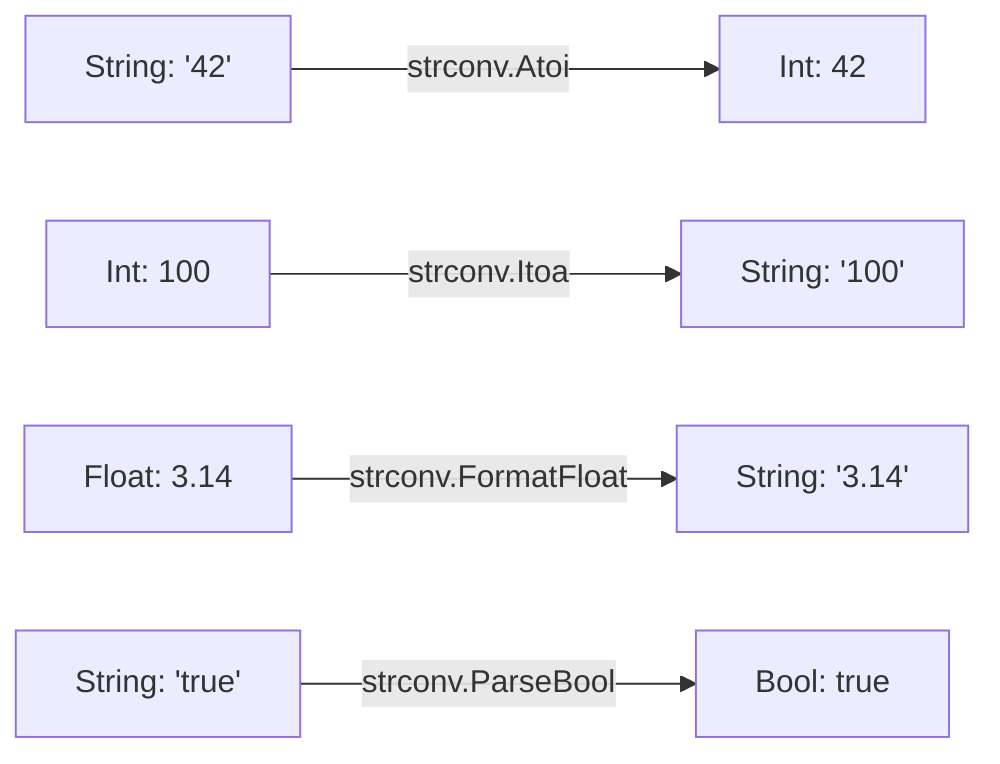

# CH-02: Conversions (Strconv)

> **Source Link**: [Go Packages: strconv](https://golang.org/pkg/strconv/)

## 1. Konsep & Esensi (Definisi & Rasionalitas)

### Definisi ("Apa itu?")
Pakat `strconv` menyediakan fungsi untuk mengonversi nilai antara tipe data dasar (int, float, bool) dan representasi string-nya secara aman.

### Rasionalitas ("Why & How?")
1. **Strict Typing**: Go sangat ketat. Anda tidak bisa menjumlahkan string "10" dan angka 10 tanpa konversi eksplisit.
2. **Input Validation**: Memastikan data string dari user/API benar-benar valid sebagai angka sebelum diproses.
3. **Format Control**: Mengontrol presisi desimal dan basis angka (biner, heksadesimal) saat konversi ke teks.

### Analogi Model Mental
Bayangkan **Alat Penerjemah Mata Uang**.
Anda punya uang (Data Int/Float) tapi ingin menuliskan nominalnya di kwitansi (String). Pakat `strconv` adalah **Kalkulator** yang memastikan angka "Rp 10.000" diterjemahkan dengan tepat menjadi angka 10000 agar bisa dihitung oleh sistem kasir.

---

## 2. Visualisasi Sistem (Mermaid)

---

## 3. Mekanisme Pembuktian (Algoritma Detil)
Pakat ini mengoptimalkan konversi dengan menghindari penggunaan `fmt` yang lebih lambat karena `fmt` menggunakan refleksi (runtime-heavy). Fungsi `Atoi` adalah singkatan dari "ASCII to Integer" dan sebaliknya `Itoa` untuk "Integer to ASCII". Pastikan selalu mengecek `error` saat menggunakan fungsi `Parse` karena input string mungkin tidak valid.

---

## 4. Lab Praktis (Examples)
Silakan tinjau folder [examples/](./examples) untuk eksperimen berikut:
- `01_safe_parse.go`: Penanganan error saat parsing data mentah.
- `02_bit_control.go`: Mengontrol basis bit (binary/hex) saat konversi.

---
*Unit ini memenuhi standar Platinum Gold (PPM V4).*
