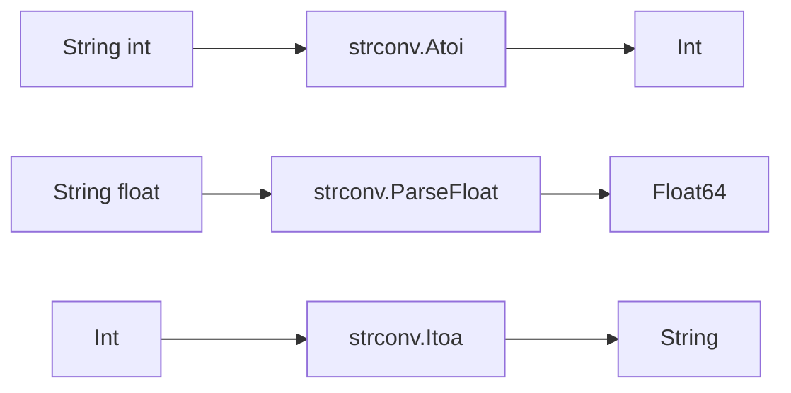

# CH-02: `strconv` for Safe Conversion

## 1. Tahap 1: Source Alignment dan Judul

- **Source Link**: [strconv package](https://pkg.go.dev/strconv)
- **Framing**: `strconv` dipakai saat data datang sebagai string, tetapi aplikasi butuh nilai yang benar-benar bertipe seperti `int`, `float64`, atau `bool`.

## 2. Tahap 2: Konsep dan Rasionalitas

### Definisi
Paket `strconv` menyediakan fungsi untuk mengonversi nilai dasar ke string dan sebaliknya. Ini termasuk parsing angka, boolean, serta formatting nilai ke representasi teks yang lebih terkontrol.

### Rasionalitas
Paket ini penting karena:

1. **Konversi jadi eksplisit dan aman**  
   Go tidak melakukan coercion otomatis, jadi parsing harus dilakukan dengan sadar.
2. **Validasi input lebih mudah**  
   Kesalahan parsing langsung dikembalikan sebagai `error`.
3. **Lebih tepat untuk konversi dasar daripada `fmt`**  
   `strconv` dirancang spesifik untuk pekerjaan ini tanpa lapisan generality tambahan.

### Analogi Model Mental
Bayangkan formulir kertas yang harus diubah menjadi angka di sistem kasir. Tulisan "12345" baru bisa dihitung setelah diterjemahkan menjadi nilai numerik yang valid.

### Terminologi Teknis
- **Parsing**: mengubah representasi teks menjadi nilai bertipe.
- **Formatting**: mengubah nilai bertipe menjadi bentuk string.
- **Base / Radix**: sistem bilangan seperti desimal, biner, atau heksadesimal.

## 3. Tahap 3: Visualisasi Sistem

## 4. Tahap 4: Mekanisme Pembuktian

Paket ini memisahkan fungsi parsing berdasarkan tipe target, misalnya `Atoi`, `ParseInt`, `ParseFloat`, dan `ParseBool`. Desain ini membuat error parsing lebih mudah ditangani dan menghindari ambiguitas. Untuk output, fungsi seperti `Itoa` atau `FormatFloat` memberi kontrol lebih jelas terhadap hasil teks.

Nilai praktisnya:
- sangat sering dipakai pada input user, query parameter, config, dan file teks;
- membantu menjaga type safety tetap jelas;
- menegaskan boundary antara data mentah dan data yang siap diproses.

## 5. Tahap 5: Lab Praktis

Lihat pembuktian di folder [examples/](./examples):
- [01_safe_parse.go](./examples/01_safe_parse.go) - Parsing `int`, `float`, dan `bool` dengan penanganan error dasar.

---
*Status: [x] Complete*
