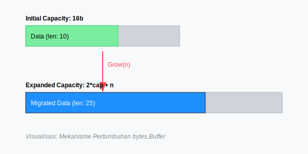

# CH-03: Byte Slices (Mutabel Manipulation)

> **Source Link**: [Go Packages: bytes](https://golang.org/pkg/bytes/)

## 1. Konsep & Esensi (Definisi & Rasionalitas)

### Definisi ("Apa itu?")
Pakat `bytes` menyediakan fungsionalitas manipulasi slice byte (`[]byte`) yang serupa dengan pakat `strings`, namun untuk data yang bersifat mutabel (bisa diubah).

### Rasionalitas ("Why & How?")
1. **Mutability**: Berbeda dengan string yang read-only, slice byte bisa dimodifikasi di tempat, menghemat alokasi memori untuk operasi berulang.
2. **Binary Data**: Esensial untuk menangani data non-tekstual seperti protokol jaringan, gambar, atau file terenkripsi.
3. **Buffer Power**: `bytes.Buffer` adalah alat serbaguna untuk membangun data dinamis yang nantinya bisa dibaca atau ditulis.

### Analogi Model Mental
Bayangkan **Papan Tulis (Whiteboard)**.
Berbeda dengan "Master Cetakan" di `strings`, `bytes` adalah **Papan Tulis** yang isinya bisa Anda hapus dan tulis ulang kapan saja tanpa membuang papannya. Sangat cocok untuk mengolah data mentah yang sering berubah-ubah.

---

## 2. Visualisasi Sistem (Mermaid & SVG)

### Mekanisme Pertumbuhan (SVG)


### Alur Buffer (Mermaid)
```mermaid
graph LR

    B1[[]byte: 'A B C'] -->|bytes.Split| S[Slice Array: [['A'], ['B'], ['C']]]
    B2[Buffer] -->|Write| B3[Data Stream]
    B3 -->|Read| B2
```

---

## 3. Mekanisme Pembuktian (Algoritma Detil)
Secara internal, `bytes.Buffer` menggunakan slice byte yang tumbuh secara eksponensial untuk meminimalkan *re-allocation*. Jika Anda tahu ukuran data di awal, gunakan `Grow(n)` untuk efisiensi maksimal. `bytes` juga menyediakan fungsi pencarian dan pembersihan (Trim) yang dioptimalkan untuk memori tinggi.

---

## 4. Lab Praktis (Examples)
Silakan tinjau folder [examples/](./examples) untuk eksperimen berikut:
- `01_bytes_buffer.go`: Pembangunan pesan dinamis dengan `bytes.Buffer`.
- `02_compare_copy.go`: Efisiensi perbandingan data biner.

---
*Unit ini memenuhi standar Platinum Gold (PPM V4).*
