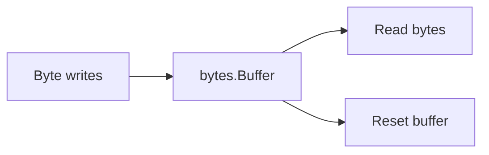

# CH-03: `bytes` and Mutable Byte Processing

## 1. Tahap 1: Source Alignment dan Judul

- **Source Link**: [bytes package](https://pkg.go.dev/bytes)
- **Framing**: Paket `bytes` penting saat data tidak lagi nyaman diperlakukan sebagai string immutable, misalnya ketika kita menyusun buffer, memproses protokol, atau bekerja dengan payload biner.

## 2. Tahap 2: Konsep dan Rasionalitas

### Definisi
Paket `bytes` menyediakan fungsi utilitas untuk `[]byte`, serta tipe seperti `bytes.Buffer` yang berguna untuk menyusun dan membaca data secara dinamis.

### Rasionalitas
Paket ini penting karena:

1. **`[]byte` bisa diubah di tempat**  
   Ini membedakannya dari string yang immutable.
2. **`bytes.Buffer` cocok untuk aliran data bertahap**  
   Kita bisa menulis, membaca, dan reset buffer tanpa selalu membuat objek baru.
3. **Bridge antara teks dan data mentah jadi lebih jelas**  
   Banyak operasi I/O dan serialisasi bekerja lebih alami di level byte.

### Analogi Model Mental
Kalau `strings` seperti dokumen cetak, `bytes` lebih mirip papan tulis atau buffer kerja yang bisa ditulis ulang, dibaca sebagian, lalu dikosongkan lagi.

### Terminologi Teknis
- **Mutable Slice**: slice byte yang isinya dapat diubah.
- **Buffer**: penyangga sementara untuk menulis dan membaca data bertahap.
- **Binary Payload**: data yang tidak harus dipahami sebagai teks manusia.

## 3. Tahap 3: Visualisasi Sistem

## 4. Tahap 4: Mekanisme Pembuktian

`bytes.Buffer` menyimpan data dalam slice internal yang dapat tumbuh saat perlu. Karena buffer ini bisa ditulis dan dibaca berkali-kali, ia sangat berguna untuk payload dinamis, staging data, atau output sementara. Saat kebutuhan utama masih teks biasa, `strings.Builder` sering cukup; saat mulai bermain dengan `[]byte`, `bytes` menjadi lebih tepat.

Nilai praktisnya:
- cocok untuk data dinamis yang dekat dengan I/O;
- membantu mengurangi pembuatan string sementara yang tidak perlu;
- menjadi jembatan alami ke topik serialisasi dan binary encoding.

## 5. Tahap 5: Lab Praktis

Lihat pembuktian di folder [examples/](./examples):
- [01_bytes_buffer.go](./examples/01_bytes_buffer.go) - Penyusunan, pembacaan sebagian, dan reset `bytes.Buffer`.

---
*Status: [x] Complete*
