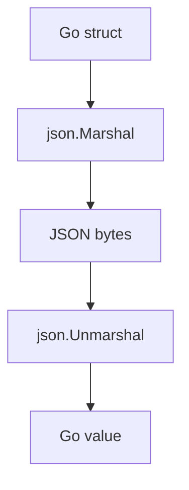

# CH-01: `encoding/json` for Structured Data Exchange

## 1. Tahap 1: Source Alignment dan Judul

- **Source Link**: [encoding/json package](https://pkg.go.dev/encoding/json) | [JSON and Go](https://go.dev/blog/json)
- **Framing**: `encoding/json` adalah pintu masuk utama saat aplikasi Go perlu bertukar data dengan sistem lain dalam format teks yang mudah dibaca manusia.

## 2. Tahap 2: Konsep dan Rasionalitas

### Definisi
Paket `encoding/json` menangani marshaling dan unmarshaling antara nilai Go dan representasi JSON. Ia membaca struct tags, memetakan field, dan juga bisa bekerja dengan data yang strukturnya tidak sepenuhnya tetap.

### Rasionalitas
Paket ini penting karena:

1. **JSON adalah format interoperabilitas paling umum**  
   API, konfigurasi, dan payload eksternal sering memakai JSON.
2. **Struct tags memberi kontrol terhadap output**  
   Nama field, penghilangan field, dan perilaku serialisasi bisa diatur cukup rapi.
3. **Ada jalur untuk data dinamis dan data terstruktur**  
   Kita bisa memakai struct saat schema jelas, atau map/interface saat input lebih longgar.

### Analogi Model Mental
Bayangkan formulir identitas yang harus diubah ke format internasional agar bisa dibaca sistem lain. Struct Go adalah data internal, sedangkan JSON adalah bentuk pertukaran yang disepakati bersama.

### Terminologi Teknis
- **Marshal**: mengubah nilai Go menjadi JSON.
- **Unmarshal**: mengubah JSON menjadi nilai Go.
- **Struct Tag**: metadata field yang membantu mengatur nama dan perilaku serialisasi.

## 3. Tahap 3: Visualisasi Sistem

## 4. Tahap 4: Mekanisme Pembuktian

Saat melakukan marshal, paket ini memeriksa field export dan struct tag untuk membentuk output JSON. Saat unmarshal, ia membaca key dari JSON lalu mencoba memetakannya ke field yang sesuai. Untuk aliran data besar atau streaming, `json.Encoder` dan `json.Decoder` memberi kontrol lebih baik daripada fungsi satu kali.

Nilai praktisnya:
- sangat sentral untuk web API dan konfigurasi;
- membantu pembaca memahami trade-off antara struct ketat dan data dinamis;
- menjadi fondasi natural sebelum masuk ke format data yang lebih rendah levelnya.

## 5. Tahap 5: Lab Praktis

Lihat pembuktian di folder [examples/](./examples):
- [01_basic_marshal.go](./examples/01_basic_marshal.go) - Marshal dan unmarshal dasar memakai struct tags.
- [02_dynamic_json.go](./examples/02_dynamic_json.go) - Membaca JSON yang bentuknya lebih dinamis dengan `map[string]interface{}`.

---
*Status: [x] Complete*
