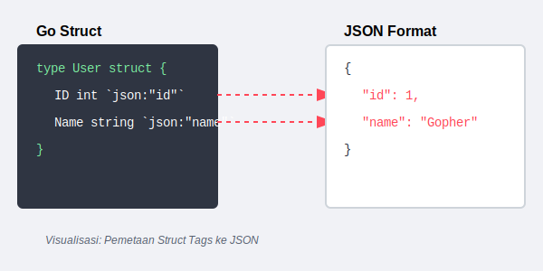
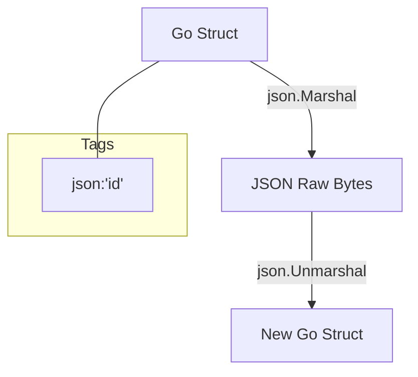

# CH-01: JSON Encoding (Serialization)

> **Source Link**: [Go Packages: encoding/json](https://golang.org/pkg/encoding/json/) | [Go Blog: JSON and Go](https://blog.golang.org/json)

## 1. Konsep & Esensi (Definisi & Rasionalitas)

### Definisi ("Apa itu?")
Pakat `encoding/json` adalah alat standar Go untuk melakukan *Marshaling* (konversi Struct ke JSON) dan *Unmarshaling* (konversi JSON ke Struct) menggunakan metadata *Struct Tags*.

### Rasionalitas ("Why & How?")
1. **Interoperability**: JSON adalah standar de-facto komunikasi API web.
2. **Type Safety**: Memastikan data dinamis dari luar tetap memiliki tipe data yang jelas di dalam aplikasi Go.
3. **Reflective Metadata**: Menggunakan *Reflect* secara internal untuk memetakan kunci JSON ke field Struct secara otomatis berdasarkan *tag*.

### Analogi Model Mental
Bayangkan **Paspor Internasional**.
Struct Go Anda adalah identitas lokal Indonesia. **JSON** adalah format Paspor Internasional agar identitas Anda bisa dibaca oleh petugas di negara lain (Python, Node.js, dsb). Pakat `json` adalah **Kantor Imigrasi** yang menerjemahkan kartu identitas Anda ke buku paspor.

---

## 2. Visualisasi Sistem (Mermaid & SVG)

### Pemetaan Field (SVG)

### Alur Kerja (Mermaid)

---

## 3. Mekanisme Pembuktian (Algoritma Detil)
Proses `Marshal` melakukan inspeksi rekursif terhadap field struct. Field yang tidak memiliki tag akan menggunakan nama field asli. Field yang bersifat privat (huruf kecil) tidak akan diproses. Untuk efisiensi tinggi (Streaming), gunakan `json.Encoder` dan `json.Decoder` alih-alih `Marshal/Unmarshal` global.

---

## 4. Lab Praktis (Examples)
Silakan tinjau folder [examples/](./examples) untuk eksperimen berikut:
- `01_basic_marshal.go`: Konversi sederhana dengan struct tags.
- `02_dynamic_json.go`: Menangani JSON yang tidak diketahui strukturnya menggunakan `map[string]interface{}`.

---
*Unit ini memenuhi standar Platinum Gold (PPM V4).*
