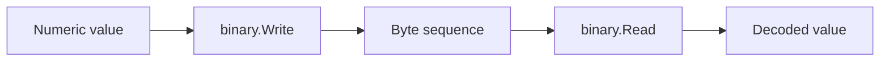

# CH-02: `encoding/binary` for Fixed-Size Data

## 1. Tahap 1: Source Alignment dan Judul

- **Source Link**: [encoding/binary package](https://pkg.go.dev/encoding/binary)
- **Framing**: `encoding/binary` dipakai saat data perlu dibaca atau ditulis sebagai urutan byte yang stabil, misalnya untuk header file, format fixed-size, atau protokol tingkat lebih rendah.

## 2. Tahap 2: Konsep dan Rasionalitas

### Definisi
Paket `encoding/binary` menangani pembacaan dan penulisan nilai fixed-size ke representasi biner. Salah satu konsep utamanya adalah memilih urutan byte, seperti `LittleEndian` atau `BigEndian`.

### Rasionalitas
Paket ini penting karena:

1. **Ukuran data bisa lebih deterministik**  
   Tidak seperti JSON, bentuk biner bisa dibuat lebih padat dan tetap.
2. **Urutan byte harus dinyatakan jelas**  
   Ini penting untuk kompatibilitas antar mesin atau format file.
3. **Membuka jalan ke data yang lebih dekat ke sistem**  
   Pembaca belajar bahwa tidak semua serialisasi perlu berbentuk teks.

### Analogi Model Mental
Kalau JSON seperti dokumen manusiawi yang dibaca orang, binary encoding lebih mirip paket sinyal mesin yang harus disusun dengan urutan byte yang tepat agar tidak salah tafsir.

### Terminologi Teknis
- **Fixed-Size Value**: nilai dengan ukuran byte yang pasti.
- **Endianness**: urutan byte paling signifikan dan paling tidak signifikan.
- **Binary Layout**: bentuk data saat sudah diwakili sebagai bytes mentah.

## 3. Tahap 3: Visualisasi Sistem

## 4. Tahap 4: Mekanisme Pembuktian

`encoding/binary` bekerja paling baik untuk nilai dengan ukuran tetap. Saat menulis, kita harus memilih byte order dengan sadar. Saat membaca, urutan byte yang dipakai harus sama dengan saat data dibuat. Untuk kasus yang sangat sederhana, helper seperti `binary.LittleEndian.Uint32` sering lebih langsung daripada abstraksi yang lebih umum.

Nilai praktisnya:
- cocok untuk header, metadata fixed-size, dan format dekat mesin;
- membantu pembaca memahami mengapa urutan byte penting;
- menjadi pelengkap yang baik setelah memahami serialisasi berbasis teks seperti JSON.

## 5. Tahap 5: Lab Praktis

Lihat pembuktian di folder [examples/](./examples):
- [01_read_binary_file.go](./examples/01_read_binary_file.go) - Membaca data fixed-size sederhana dengan `encoding/binary`.

---
*Status: [x] Complete*
