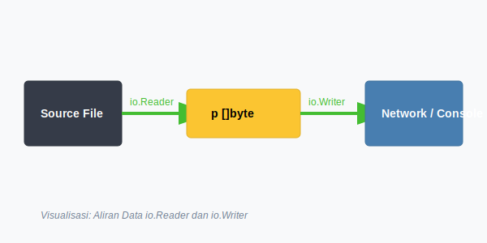
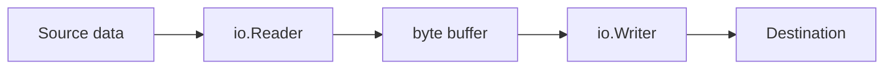

# CH-01: `io.Reader` and `io.Writer`

## 1. Tahap 1: Source Alignment dan Judul

- **Source Link**: [io package](https://pkg.go.dev/io)
- **Framing**: Package `io` penting karena ia tidak sekadar memberi fungsi bantu, tetapi menetapkan kontrak paling dasar untuk aliran data di Go.

## 2. Tahap 2: Konsep dan Rasionalitas

### Definisi
`io.Reader` dan `io.Writer` adalah interface dasar yang mewakili sumber dan tujuan data. Banyak package lain di Go dibangun di atas dua kontrak ini, sehingga file, buffer, network connection, dan stream lain bisa diperlakukan dengan pola yang seragam.

### Rasionalitas
Topik ini penting karena:

1. **Composability jadi sangat kuat**  
   Selama sebuah tipe memenuhi kontrak `Reader` atau `Writer`, ia bisa dipasang ke banyak utilitas standar.
2. **Streaming lebih natural**  
   Data tidak harus dimuat penuh ke memori sebelum diproses.
3. **Fondasi package lain jadi lebih mudah dipahami**  
   `bufio`, `net/http`, `os`, dan banyak area lain bergantung pada interface ini.

### Analogi Model Mental
Bayangkan selang air dengan ukuran sambungan yang sudah disepakati. Selama ujung pipa cocok, Anda bisa menghubungkan sumber dan tujuan apa pun tanpa peduli mereknya.

### Terminologi Teknis
- **Reader**: sumber yang mengisi buffer byte.
- **Writer**: tujuan yang menerima buffer byte untuk ditulis.
- **Streaming**: pemrosesan data bertahap tanpa harus memuat seluruh isi sekaligus.

## 3. Tahap 3: Visualisasi Sistem

## 4. Tahap 4: Mekanisme Pembuktian

Method `Read(p []byte)` meminta caller menyediakan buffer lalu mengembalikan jumlah byte yang benar-benar terisi. Method `Write(p []byte)` melakukan kebalikannya. Desain ini memberi kontrol yang kuat terhadap alokasi memori dan membuat utilitas seperti `io.Copy` bisa bekerja di atas banyak tipe berbeda tanpa perlu tahu detail implementasinya.

Nilai praktisnya:
- membantu pembaca melihat Go sebagai ekosistem kontrak, bukan kumpulan package terpisah;
- menjelaskan kenapa aliran data di Go terasa konsisten;
- menjadi fondasi sebelum masuk ke buffering dan file management.

## 5. Tahap 5: Lab Praktis

Lihat pembuktian di folder [examples/](./examples):
- [01_custom_reader.go](./examples/01_custom_reader.go) - Reader kustom sederhana yang mengubah huruf kecil menjadi huruf besar sebelum diteruskan ke output.

---
*Status: [x] Complete*
