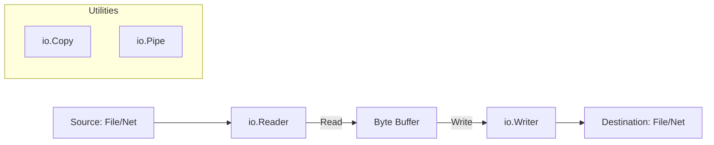

# CH-01: Reader & Writer (IO Abstractions)

> **Source Link**: [Go Packages: io](https://golang.org/pkg/io/) | [Go Blog: The Laws of Reflection (Implicit relevance to IO Interfaces)](https://blog.golang.org/laws-of-reflection)

## 1. Konsep & Esensi (Definisi & Rasionalitas)

### Definisi ("Apa itu?")
Pakat `io` mendefinisikan interface dasar `Reader` dan `Writer` yang menjadi fondasi seluruh operasi input/output di Go, memungkinkan aliran data yang konsisten antar file, jaringan, hingga memori.

### Rasionalitas ("Why & How?")
1. **Composability**: Anda bisa membungkus `Reader` apa pun dengan enkripsi, kompresi, atau logging tanpa peduli sumber datanya.
2. **Memory Efficiency**: Mendukung *Streaming* (baca per blok) sehingga aplikasi tidak perlu memuat file 10GB ke dalam RAM sekaligus.
3. **Universal Contract**: Hampir semua pakat di Standlib menggunakan kontrak ini, membuat integrasi antar modul sangat mudah.

### Analogi Model Mental
Bayangkan **Selang Air**.
`Reader` adalah ujung selang yang menyedot air (data), dan `Writer` adalah ujung selang yang menyemprotkan air. Anda bisa menyambungkan selang dari tangki (File) ke ember (Jaringan) menggunakan sambungan standar (Interface). Anda tidak perlu tahu pompanya merek apa, selama diameter selangnya pas.

---

## 2. Visualisasi Sistem (Mermaid & SVG)

### Aliran Data (SVG)

### Hirarki Interface (Mermaid)

---

## 3. Mekanisme Pembuktian (Algoritma Detil)
Metode `Read(p []byte)` mengisi buffer `p` dan mengembalikan jumlah byte yang dibaca serta error (termasuk `io.EOF`). Desain ini memaksa pemanggil untuk mengalokasikan memori terlebih dahulu, memberikan kontrol penuh terhadap penggunaan RAM. `io.Copy` mengoptimalkan pemindahan data antar interface dengan menghindari buffer perantara jika memungkinkan.

---

## 4. Lab Praktis (Examples)
Silakan tinjau folder [examples/](./examples) untuk eksperimen berikut:
- `01_custom_reader.go`: Membuat filter teks sederhana dengan interface `Reader`.
- `02_io_copy_stream.go`: Memindahkan data dari file ke standard output secara efisien.

---
*Unit ini memenuhi standar Platinum Gold (PPM V4).*
