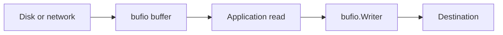

# CH-02: `bufio` and Buffered Access

## 1. Tahap 1: Source Alignment dan Judul

- **Source Link**: [bufio package](https://pkg.go.dev/bufio)
- **Framing**: `bufio` dipakai saat operasi I/O kecil terlalu sering menyentuh sistem operasi secara langsung dan perlu diberi lapisan buffer agar lebih efisien.

## 2. Tahap 2: Konsep dan Rasionalitas

### Definisi
Paket `bufio` membungkus `Reader` atau `Writer` lain dengan buffer di memori. Ia juga menyediakan helper seperti `Scanner` untuk membaca data berbasis token atau baris.

### Rasionalitas
Topik ini penting karena:

1. **Syscall bisa dikurangi**  
   Operasi kecil tidak harus selalu pergi ke disk atau jaringan satu per satu.
2. **Scanning baris jadi jauh lebih mudah**  
   `bufio.Scanner` memberi jalur praktis untuk memproses teks bertahap.
3. **Buffering menjelaskan banyak pola I/O di Go**  
   Banyak package memanfaatkan ide dasar yang sama demi throughput dan ergonomi.

### Analogi Model Mental
Tanpa buffer, Anda seperti bolak-balik ke sumur untuk satu gelas air. Dengan `bufio`, Anda membawa ember lebih besar lalu menuangkannya sedikit-sedikit saat dibutuhkan.

### Terminologi Teknis
- **Buffer**: area memori sementara untuk menampung data.
- **Scanner**: helper untuk membaca data bertahap, sering per baris.
- **Flush**: mengirim isi buffer writer ke tujuan sebenarnya.

## 3. Tahap 3: Visualisasi Sistem

## 4. Tahap 4: Mekanisme Pembuktian

`bufio.Reader` mengisi buffer lebih dulu lalu melayani pembacaan berikutnya dari memori. `bufio.Writer` menahan write kecil sampai buffer penuh atau sampai `Flush()` dipanggil. Sementara itu, `Scanner` memberi API yang sederhana untuk teks, walau tetap punya batas default ukuran token yang perlu diingat.

Nilai praktisnya:
- cocok untuk file teks, log, dan stream kecil berulang;
- mengurangi overhead operasi kecil yang terlalu sering;
- membuat pembaca lebih paham kapan buffering memberi dampak nyata.

## 5. Tahap 5: Lab Praktis

Lihat pembuktian di folder [examples/](./examples):
- [01_buffered_reading.go](./examples/01_buffered_reading.go) - Membaca input multi-baris dengan `bufio.Scanner`.

---
*Status: [x] Complete*
