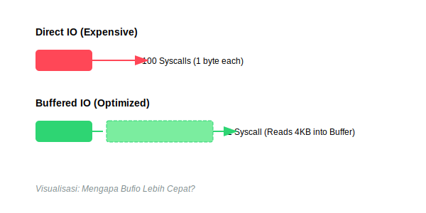
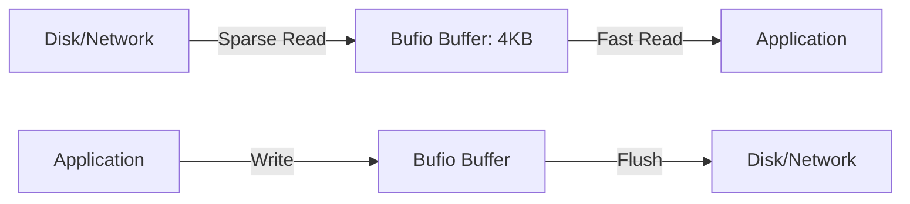

# CH-02: Buffered IO (Bufio)

> **Source Link**: [Go Packages: bufio](https://golang.org/pkg/bufio/)

## 1. Konsep & Esensi (Definisi & Rasionalitas)

### Definisi ("Apa itu?")
Pakat `bufio` membungkus `io.Reader` atau `io.Writer` lainnya untuk menyediakan buffering (penyanggaan), yang mengurangi jumlah pemanggilan syscall (sistem operasi) yang mahal saat membaca/menulis data kecil secara berulang.

### Rasionalitas ("Why & How?")
1. **Performance**: Membaca file 1 byte per 1 byte langsung dari disk sangat lambat. `bufio` mengambil 4KB (default) sekaligus ke memori agar pembacaan berikutnya instan.
2. **Scanner Utility**: Menyediakan `Scanner` yang sangat berguna untuk membaca data berbasis baris (Line-by-line) dengan mudah.
3. **Write Management**: Menjamin data dikumpulkan terlebih dahulu sebelum benar-benar "ditembakkan" ke disk atau jaringan dalam satu paket besar.

### Analogi Model Mental
Bayangkan **Ember Penampung Air**.
Tanpa `bufio`, Anda lari bolak-balik ke sumur (Disk) untuk mengambil 1 gelas air (1 byte). Dengan `bufio`, Anda membawa **Ember** (4KB buffer). Anda mengisi ember sekali di sumur, lalu bisa menuang 4000 gelas air dengan cepat di rumah tanpa perlu lari-lari lagi.

---

## 2. Visualisasi Sistem (Mermaid & SVG)

### Optimasi Performance (SVG)

### Alur Buffer (Mermaid)

---

## 3. Mekanisme Pembuktian (Algoritma Detil)
`bufio.Reader` melakukan *filling* (pengisian) buffer saat data kosong. Sebaliknya, `bufio.Writer` harus di-`Flush()` secara manual (atau saat buffer penuh) untuk memastikan data benar-benar terkirim ke `underlying writer`. `Scanner` memiliki batas default 64KB per baris; gunakan `Buffer()` jika ingin membaca baris yang lebih panjang.

---

## 4. Lab Praktis (Examples)
Silakan tinjau folder [examples/](./examples) untuk eksperimen berikut:
- `01_buffered_reading.go`: Perbandingan kecepatan pembacaan dengan vs tanpa `bufio`.
- `02_line_scanner.go`: Ekstraksi data dari file log baris demi baris secara efisien.

---
*Unit ini memenuhi standar Platinum Gold (PPM V4).*
