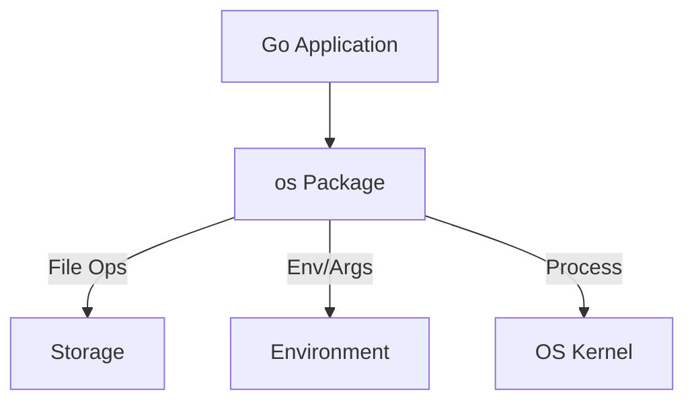

# CH-01: OS Operations (System Interaction)

> **Source Link**: [Go Packages: os](https://golang.org/pkg/os/)

## 1. Konsep & Esensi (Definisi & Rasionalitas)

### Definisi ("Apa itu?")
Pakat `os` menyediakan interface yang platform-independen untuk mengakses fungsionalitas sistem operasi seperti manipulasi file, variabel lingkungan (environment variables), dan proses.

### Rasionalitas ("Why & How?")
1. **Abstraction**: Anda tidak perlu tahu apakah sedang berjalan di Windows atau Linux untuk membuat folder atau menghapus file.
2. **File Lifecycle**: Menyediakan kontrol penuh atas pembukaan file dengan berbagai mode (Read/Write, Append, Create).
3. **Runtime Context**: Mengambil argumen baris perintah (`os.Args`) dan berinteraksi dengan status keluar program (`os.Exit`).

### Analogi Model Mental
Bayangkan **Asisten Pribadi (PA)**.
Anda (Program) tidak perlu turun tangan sendiri untuk membangun gudang (Folder) atau membuang sampah (Hapus File). Anda cukup memberi perintah kepada **PA (Pakat os)**, dan dia yang akan berbicara dengan Pemerintah (Sistem Operasi) sesuai aturan yang berlaku di negara tersebut.

---

## 2. Visualisasi Sistem (Mermaid)

---

## 3. Mekanisme Pembuktian (Algoritma Detil)
Fungsi `os.Open` membuka file dengan mode *read-only*. Gunakan `os.OpenFile` jika butuh kontrol lebih detail (seperti penambahan data/append). Jangan lupa selalu memanggil `defer file.Close()` untuk melepaskan deskriptor file agar tidak terjadi kebocoran sumber daya sistem (file handle limit).

---

## 4. Lab Praktis (Examples)
Silakan tinjau folder [examples/](./examples) untuk eksperimen berikut:
- `01_file_crud.go`: Operasi Create, Read, Update, dan Delete file secara aman.
- `02_env_vars.go`: Mengelola konfigurasi aplikasi menggunakan variabel lingkungan.

---
*Unit ini memenuhi standar Platinum Gold (PPM V4).*
