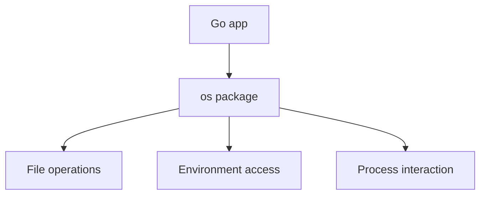

# CH-01: `os` for File and Environment Operations

## 1. Tahap 1: Source Alignment dan Judul

- **Source Link**: [os package](https://pkg.go.dev/os)
- **Framing**: Package `os` menjadi jembatan utama antara program Go dan sistem operasi, terutama saat aplikasi perlu membuat, membaca, memeriksa, atau menghapus file.

## 2. Tahap 2: Konsep dan Rasionalitas

### Definisi
Paket `os` menyediakan akses ke operasi file, directory, environment variable, process state, dan hal-hal lain yang dekat dengan sistem operasi tetapi dibungkus dalam API lintas platform yang lebih nyaman.

### Rasionalitas
Topik ini penting karena:

1. **Operasi file dasar ada di sini**  
   Banyak workflow aplikasi butuh create, read, stat, dan remove file.
2. **Abstraksi lintas platform membantu**  
   Program tidak perlu menulis ulang operasi dasar untuk Windows dan Unix dari nol.
3. **Context runtime aplikasi jadi bisa dibaca**  
   Environment dan argumen proses juga berada di wilayah package ini.

### Analogi Model Mental
Bayangkan `os` seperti asisten administrasi yang mengurus berkas dan izin akses ke lemari arsip. Program Anda tinggal memberi perintah yang benar, lalu asisten itu yang berurusan dengan aturan gedung.

### Terminologi Teknis
- **File Descriptor / Handle**: representasi resource file yang dibuka.
- **Stat**: metadata file seperti ukuran atau waktu modifikasi.
- **Environment Variable**: nilai konfigurasi yang diberikan dari lingkungan proses.

## 3. Tahap 3: Visualisasi Sistem

## 4. Tahap 4: Mekanisme Pembuktian

Package ini memberi fungsi tingkat tinggi seperti `ReadFile`, `WriteFile`, `Stat`, dan `Remove`, plus API yang lebih detail jika kontrol tambahan diperlukan. Inti yang perlu dipahami pembaca adalah bahwa operasi ini tetap menyentuh resource OS nyata, jadi penanganan error dan cleanup tetap penting.

Nilai praktisnya:
- sangat relevan untuk utility, CLI, dan service yang menyentuh filesystem;
- membantu membedakan operasi file sederhana dari kontrak I/O murni;
- menjadi fondasi sebelum pembaca belajar soal asset embedding.

## 5. Tahap 5: Lab Praktis

Lihat pembuktian di folder [examples/](./examples):
- [01_file_crud.go](./examples/01_file_crud.go) - Alur create, read, stat, dan delete file sederhana dengan cleanup di akhir.

---
*Status: [x] Complete*
