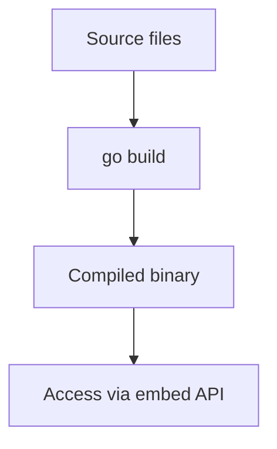

# CH-02: `embed` for Bundled Assets

## 1. Tahap 1: Source Alignment dan Judul

- **Source Link**: [embed package](https://pkg.go.dev/embed) | [Package embed](https://go.dev/blog/embed)
- **Framing**: `embed` dipakai saat aplikasi perlu membawa file statis langsung ke dalam binary, sehingga distribusi dan deployment jadi lebih sederhana.

## 2. Tahap 2: Konsep dan Rasionalitas

### Definisi
Paket `embed` memungkinkan file atau direktori statis disertakan saat kompilasi. Data yang di-embed kemudian bisa diakses sebagai `string`, `[]byte`, atau `embed.FS`.

### Rasionalitas
Topik ini penting karena:

1. **Single-binary deployment jadi lebih realistis**  
   Config, template, atau asset kecil bisa ikut dibawa tanpa folder terpisah.
2. **File statis tetap diakses lewat API yang familiar**  
   Dengan `embed.FS`, pembaca tetap bisa berpikir dalam model filesystem.
3. **Resiko missing file di produksi bisa dikurangi**  
   Asset penting tidak lagi tergantung keberadaan file eksternal saat runtime.

### Analogi Model Mental
Kalau tanpa `embed` Anda mengirim buku dan amplop foto secara terpisah, dengan `embed` foto-foto itu sudah dicetak langsung ke halaman buku yang sama.

### Terminologi Teknis
- **Embedded Asset**: file yang dibawa ke binary saat build.
- **Directive**: komentar compiler `//go:embed` yang menentukan file apa yang diikutkan.
- **embed.FS**: representasi filesystem virtual untuk file yang di-embed.

## 3. Tahap 3: Visualisasi Sistem

## 4. Tahap 4: Mekanisme Pembuktian

Compiler membaca directive `//go:embed` lalu memasukkan file target ke dalam binary saat build. Setelah itu, aplikasi tidak perlu lagi mengandalkan file eksternal yang sama di runtime. Karena sifatnya read-only, `embed` cocok untuk asset statis yang stabil, bukan data yang harus diubah saat program berjalan.

Nilai praktisnya:
- mempermudah distribusi aplikasi kecil atau tool tunggal;
- berguna untuk config, template, atau asset pendukung;
- membantu pembaca memahami trade-off antara file eksternal dan binary yang lebih mandiri.

## 5. Tahap 5: Lab Praktis

Lihat pembuktian di folder [examples/](./examples):
- [01_embed_config.go](./examples/01_embed_config.go) - Menyertakan `test_data.txt` ke dalam binary dengan directive `//go:embed`.
- [test_data.txt](./examples/test_data.txt) - File statis sederhana yang dipakai sebagai payload embed.

---
*Status: [x] Complete*
