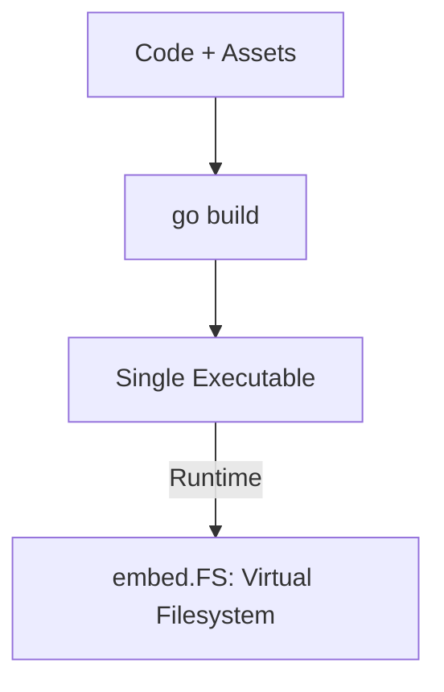

# CH-02: Embed System (Binary Inlining)

> **Source Link**: [Go Packages: embed](https://golang.org/pkg/embed/) | [Go Blog: Package embed](https://blog.golang.org/embed)

## 1. Konsep & Esensi (Definisi & Rasionalitas)

### Definisi ("Apa itu?")
Pakat `embed` (diperkenalkan di Go 1.16) memungkinkan penyertaan file statis (seperti gambar, HTML, atau config) langsung ke dalam file biner Go saat proses kompilasi.

### Rasionalitas ("Why & How?")
1. **Single Binary Deployment**: Tidak perlu lagi menyertakan folder `assets/` secara terpisah saat mendeploy aplikasi. Cukup satu file biner.
2. **Type Safety**: Menyediakan akses ke file tersebut melalui interface yang sudah dikenal (`FS`, `ReadFile`).
3. **No External Dependecies**: Mengurangi risiko error "File Not Found" di produksi karena data statis sudah "melekat" di dalam kode.

### Analogi Model Mental
Bayangkan **Buku yang Berisi Foto**.
Tanpa `embed`, Anda memberikan buku (Program) ke teman, tapi foto-fotonya terpisah di amplop lain. Jika amplopnya hilang, ceritanya tidak lengkap. Dengan `embed`, Anda **Mencetak Foto Langsung di Halaman Buku**. Di mana pun bukunya berada, fotonya pasti ada di sana.

---

## 2. Visualisasi Sistem (Mermaid)

---

## 3. Mekanisme Pembuktian (Algoritma Detil)
Gunakan direktif `//go:embed path/to/file` tepat di atas variabel. Variabel tersebut bisa bertipe `string`, `[]byte`, atau `embed.FS` untuk akses ke banyak file sekaligus. Data yang di-embed bersifat *read-only* dan tidak menambah beban memori di runtime hingga data tersebut benar-benar diakses (mengingat ia disimpan di segmen data biner).

---

## 4. Lab Praktis (Examples)
Silakan tinjau folder [examples/](./examples) untuk eksperimen berikut:
- `01_embed_config.go`: Memasukkan file JSON konfigurasi ke dalam aplikasi.
- `02_embed_web_assets.go`: Menyajikan file HTML/CSS dari biner tunggal.

---
*Unit ini memenuhi standar Platinum Gold (PPM V4).*
