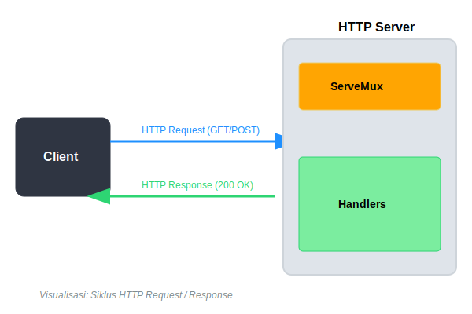

# CH-01: HTTP Client & Server (Web Protocols)

> **Source Link**: [Go Packages: net/http](https://golang.org/pkg/net/http/) | [Go Blog: HTTP/2 in Go 1.6](https://blog.golang.org/http2)

## 1. Konsep & Esensi (Definisi & Rasionalitas)

### Definisi ("Apa itu?")
Pakat `net/http` menyediakan implementasi protokol HTTP tingkat tinggi, memungkinkan pembuatan server web yang tangguh dan client yang efisien langsung dari toolchain standar Go.

### Rasionalitas ("Why & How?")
1. **Production-Ready**: Server bawaan Go sangat stabil dan digunakan oleh raksasa teknologi (Google, Cloudflare) tanpa butuh framework tambahan.
2. **Concurrency Native**: Setiap request yang masuk otomatis ditangani oleh goroutine tersendiri (Thread-per-request model).
3. **Standard Contract**: Antara Client dan Server menggunakan tipe data yang sama (`Request` dan `Response`), mempermudah debugging dan pengembangan terdistribusi.

### Analogi Model Mental
Bayangkan **Restoran Pintar**.
Client (Anda) mengirim pesanan (Request) lewat **Pelayan (http.Client)**. Di dapur, ada **Koki (http.Server)** yang menerima pesanan tersebut. Karena restorannya "Pintar", ada banyak koki (Goroutines) yang bekerja sekaligus, sehingga tidak perlu antre panjang untuk mendapatkan makanan (Response).

---

## 2. Visualisasi Sistem (Mermaid & SVG)

### Siklus Request-Response (SVG)


### Alur Komunikasi (Mermaid)
```mermaid
sequenceDiagram

    Client->>Server: Request: GET /api/data
    Note over Server: Match Handler (Mux)
    Server-->>Client: Response: 200 OK (JSON)
    
    subgraph Internals
        direction TB
        M[ServeMux: Router]
        H[Handler: Logic]
        M --> H
    end
```

---

## 3. Mekanisme Pembuktian (Algoritma Detil)
Go menggunakan `ServeMux` (Multi-plexer) untuk memetakan URL ke fungsi handler yang tepat. Untuk Client, pastikan selalu menutup body response (`resp.Body.Close()`) agar koneksi TCP bisa digunakan kembali (*Keep-Alive*). Kegagalan melakukan ini akan menyebabkan kebocoran memory dan file handle.

---

## 4. Lab Praktis (Examples)
Silakan tinjau folder [examples/](./examples) untuk eksperimen berikut:
- `01_simple_api_server.go`: Membangun endpoint JSON sederhana.
- `02_http_client_post.go`: Mengirim data ke API eksternal dengan timeout.

---
*Unit ini memenuhi standar Platinum Gold (PPM V4).*
